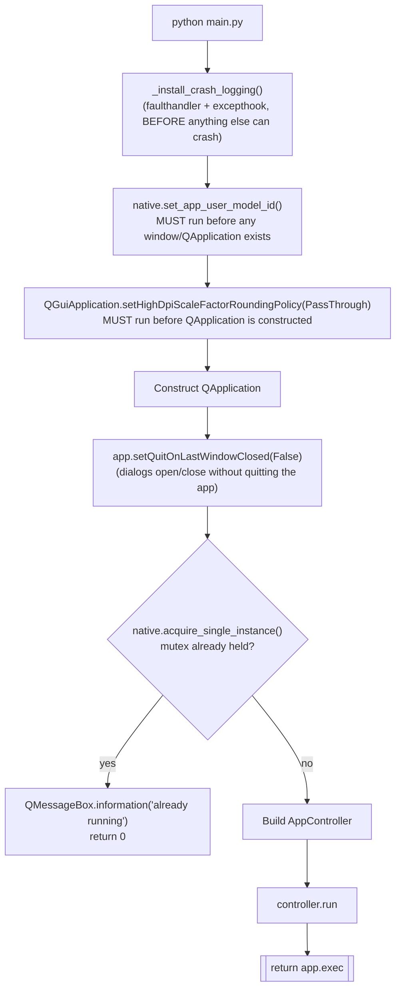

# Main (Entry Point) — Flow

**About:** [description](../__about/main.md)

## Algorithm — an order-dependent startup sequence

Pseudocode (language-neutral — the ordering comments matter as much as
the calls):

    _install_crash_logging()
        # runs FIRST: a trace for the next crash before anything
        # else in this function can itself crash

    native.set_app_user_model_id(APP_USER_MODEL_ID)
        # BEFORE any window or QApplication exists — needs no HWND;
        # fixes dialogs showing python's own icon in the taskbar

    QGuiApplication.setHighDpiScaleFactorRoundingPolicy(PassThrough)
        # BEFORE QApplication is constructed — otherwise 125%/150%
        # Windows scaling rounds to an integer instead of a true
        # fractional devicePixelRatio

    app = QApplication(argv)
    app.setApplicationName / setOrganizationName
    app.setQuitOnLastWindowClosed(False)
        # the dial is a Qt.Tool window and the settings dialog comes
        # and goes — without this, closing any dialog would quit the
        # whole app

    IF NOT native.acquire_single_instance(SINGLE_INSTANCE_MUTEX):
        show "already running" message
        RETURN 0

    controller = AppController(app)
    controller.run()
    RETURN app.exec()
