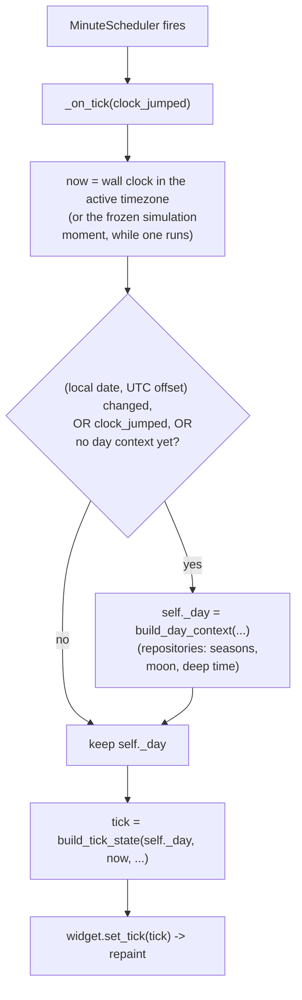
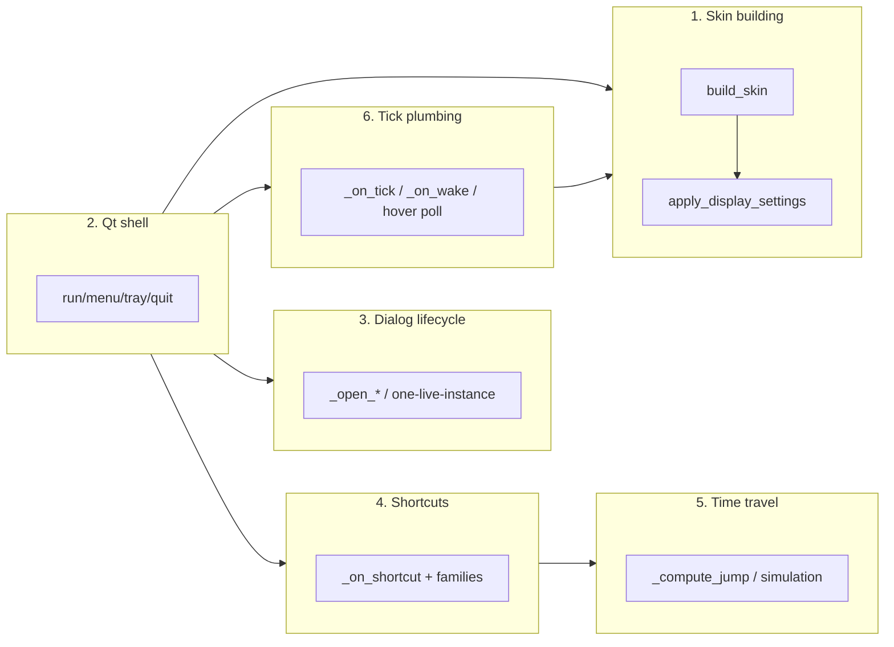

# Watch Controller — Flow

**About:** [description](../__about/controller.md)

## Algorithm — tick flow



Unreadable or out-of-coverage astronomical data raises OUT of
`build_day_context` — the controller shows a visible dialog and exits
rather than let the dial silently render something wrong.

## Layout — the right-click / tray menu (`_build_menu`)

```mermaid
%%{init: {'flowchart': {'subGraphTitleMargin': {'top': 0, 'bottom': 35}}}}%%
flowchart TB
    subgraph MENU["_StayOpenMenu — shared by tray popup and dial right-click"]
        TITLE["TITLE row (location, or the full name form with 2+ watches)"]
        ADD["Add Watch"]
        REM["Remove this Watch (watches 2+ only)"]
        SHOW["Show (tray-only — hidden on the dial's own popup)"]
        DESIGN["Design...   Pointer Theme...   Slot Theme..."]
        VIS["Visible ▸ (dropdown: Pointer/Colorful/Earth/Moon/Seconds)"]
        TOGGLES["Legend   Solar rotation   Archetype   Click-through"]
        DIALOGS["Settings...   Encyclopedia...   Observatory...
        Guide...   Time Travel..."]
        REPORT["Report (hidden until the secret code unlocks it)"]
        EXIT["Exit"]
    end
    TITLE --> ADD --> REM --> SHOW --> DESIGN --> VIS --> TOGGLES --> DIALOGS --> REPORT --> EXIT
```



Every level is a `_StayOpenMenu` — checkable picks (and actions tagged
`"stay_open"`) keep it open so several settings can change in one visit.

## Algorithm — `_compute_jump` (the shared travel arithmetic)

```mermaid
%%{init: {'flowchart': {'subGraphTitleMargin': {'top': 0, 'bottom': 35}}}}%%
flowchart TB
    A["_compute_jump(moment, observer, cycles, kind, city)"] --> B{kind matches
    the sun/moon pattern?}
    B -- yes --> C["find nearest turning point/phase,
    narrowed by the optional phase filter"]
    B -- no --> D{kind is a place (pole/Greenwich/city)?}
    D -- yes --> E["real coordinates, real local clock"]
    D -- no --> F{kind is a calendar unit (day/month/year/century/millennium)?}
    F -- yes --> G["shift_calendar(moment, unit)"]
    C --> H
    E --> H
    G --> H{landing found?}
    H -- no --> I[(None — edge clamp, no-op)]
    H -- yes --> J["deep-travel events rebased into the
    caller's proxy frame via julian_day_of"]
    J --> K["re-canonicalize into the 400-year proxy
    (canonical_proxy) before returning"]
    K --> L[("(moment, observer, cycles)")]
```

Three callers wrap this pure function: `_apply_jump` (keyboard
shortcuts — starts/refreshes the live simulation directly),
`_dialog_jump` (the Time Travel dialog's Quick Jump rows — starts the
live simulation AND returns the landing for the dialog to mirror onto
its own fields), and the Time Travel dialog's own OK button (via
`TimeTravelDialog.moment()`/`.cycles()`, which the controller reads
directly rather than through `_compute_jump`).

## Responsibility map (see `__about/controller.md` for the split this owes)


