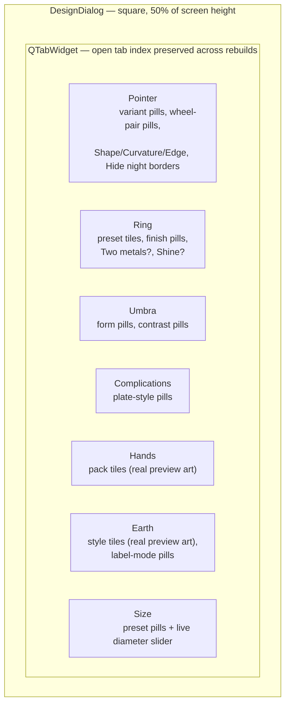
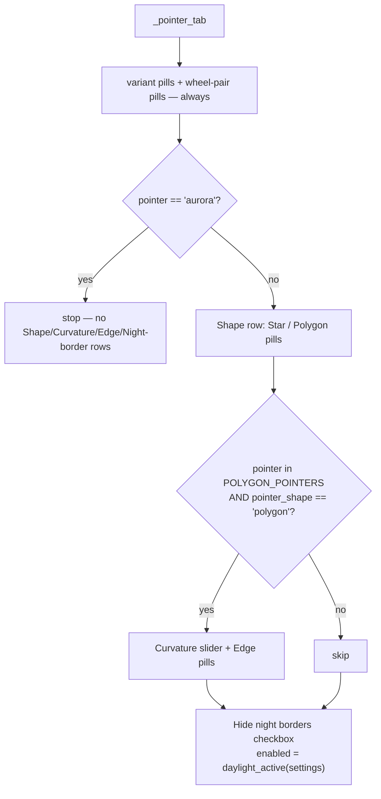

# Design Window — Flow

**About:** [description](../__about/design_window.md)

## Layout

## Algorithm — Pointer tab row gating

Every row reads the CURRENT `settings.pointer`/`pointer_shape` fresh on
each build, so a pointer switch alone re-gates the whole tab on the next
live-apply rebuild — no extra wiring needed.
