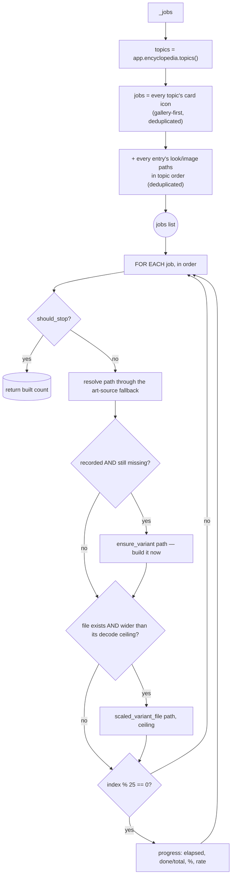

# Encyclopedia Warm — Flow

**About:** [description](../__about/encyclopedia_warm.md)

## Algorithm — `warm_encyclopedia`

Pseudocode:

    FUNCTION warm_encyclopedia(progress, should_stop):
        jobs <- _jobs()                       # deduplicated (path, ceiling) pairs
        FOR EACH (raw, ceiling), index IN jobs:
            IF should_stop() -> RETURN built_count
            path <- resolve raw through the art-source fallback
            IF path is a recorded, still-missing metal variant:
                ensure_variant(path); built_count += 1
            IF path exists AND is wider than ceiling:
                scaled_variant_file(path, ceiling)
            EVERY 25 jobs -> progress(elapsed, done/total, %, rate)
        RETURN built_count
