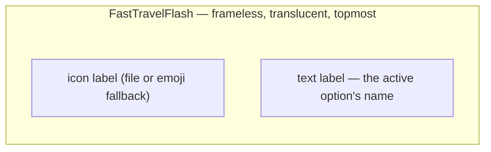
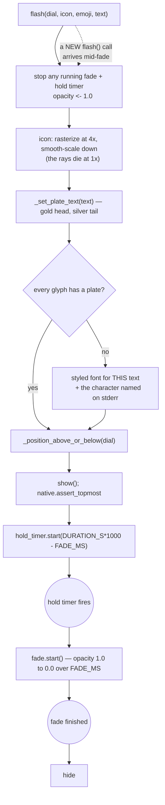

# Fast Travel Flash — Flow

**About:** [description](../__about/fast_travel_flash.md)

## Layout

Positioned centered above the dial's current on-screen rectangle, or
below it when the dial sits at the top edge of its screen. ONE position
for every flash since the owner's order of 2026-08-12 — a LOCATION change
used to take a second look (big font letters centered ON the dial, no
icon) and now wears the same plates in the same place, with its own logo.

## Algorithm — `flash()` lifecycle

A repeated Ctrl+[ / Ctrl+] press always restarts at step B — the
running fade and hold timer are stopped first, so rapid presses never
stack a half-faded toast under a fresh one.
