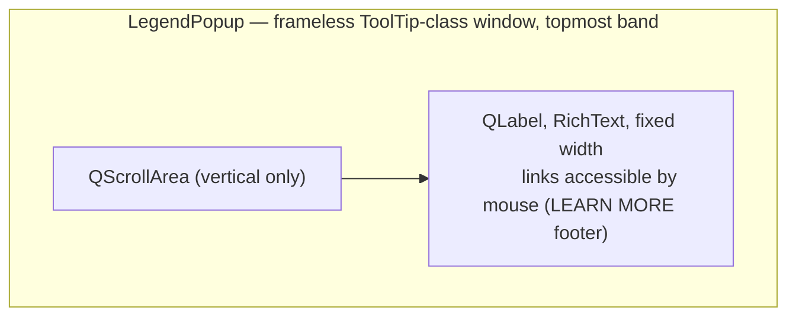
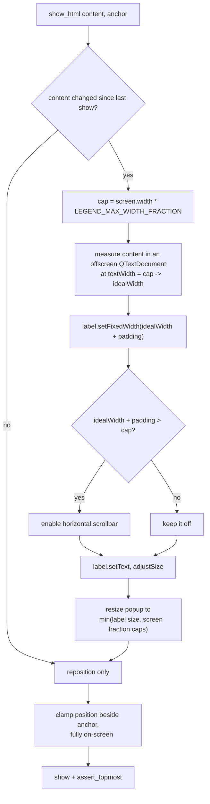

# Legend Popup — Flow

**About:** [description](../__about/legend_popup.md)

## Layout

## Algorithm — `show_html(content, anchor)`

Pseudocode:

    FUNCTION show_html(content, anchor):
        IF content == last shown content:
            reposition only, RETURN
        cap <- screen(anchor).width * LEGEND_MAX_WIDTH_FRACTION
        document.setHtml(content); document.setTextWidth(cap)
        wanted <- ceil(document.idealWidth()) + 2*LEGEND_PADDING_PX
        label.setFixedWidth(max(wanted, 1))
        scrollbar.horizontal <- (wanted > cap) ? AsNeeded : AlwaysOff
        label.setText(content); label.adjustSize()
        popup.resize(min(label.width + frame, cap),
                     min(label.height, screen.height * LEGEND_MAX_HEIGHT_FRACTION))
        position popup beside anchor, clamped to the screen
        show(); native.assert_topmost(popup)
