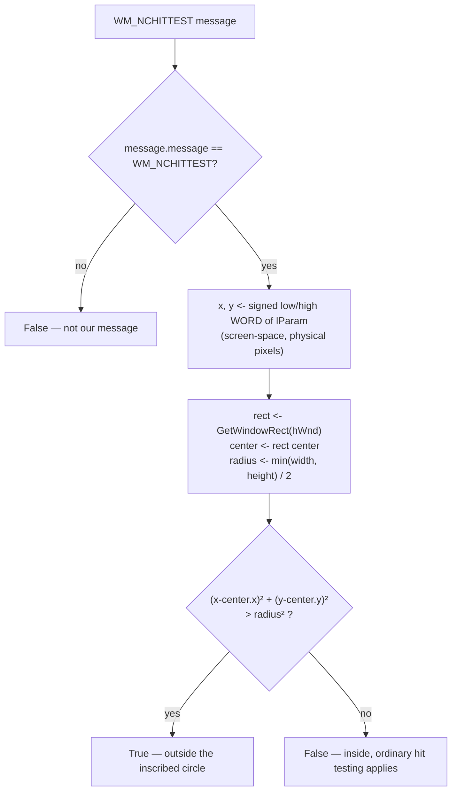
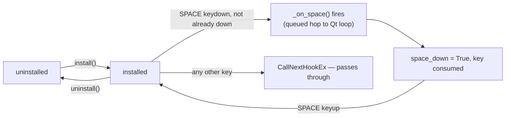

# Native — Flow

**About:** [description](../__about/native.md)

## Algorithm — `nchittest_falls_outside` (the circular hit test)

The caller ([Clock Widget](../__about/widget.md)'s `nativeEvent`) returns
`winapi.HTTRANSPARENT` when this is True, so a click on the window's
square corner falls through to whatever lies beneath instead of hitting
the transparent margin.

## State machine — KeyboardHook

`install()`/`uninstall()` are both idempotent; the widget arms the hook
on hover-enter of a page-bearing target and disarms it on hover-leave,
`hideEvent`, click-through toggle and quit, so SPACE is only ever
consumed during a deliberate hover.
