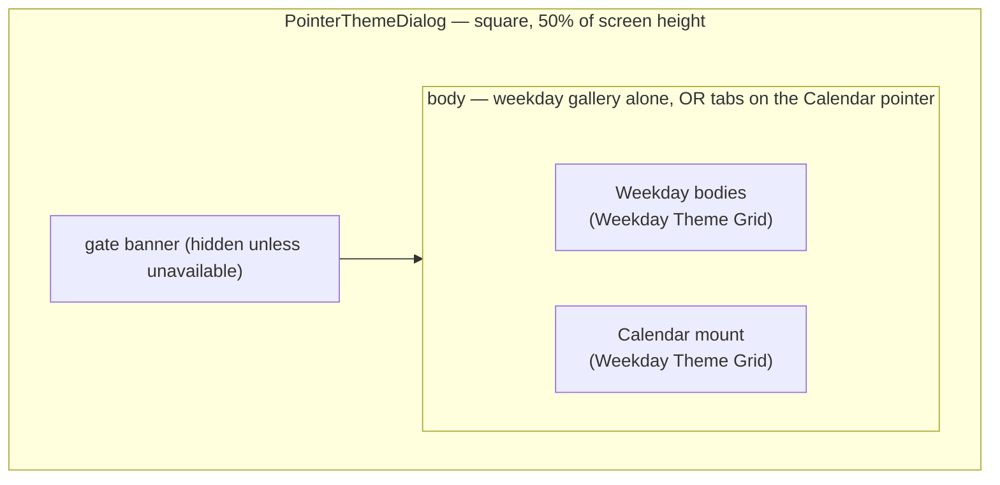
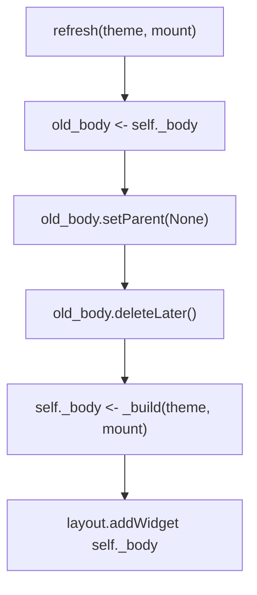

# Pointer Theme — Flow

**About:** [description](../__about/pointer_theme.md)

## Layout

## Algorithm — content rebuild on refresh

    FUNCTION _build(current_theme, current_mount):
        weekday <- build_weekday_theme_grid(current_theme, on_pick, tr)
        IF current_mount is None OR on_pick_mount is None:
            RETURN weekday                       # single gallery
        RETURN QTabWidget with weekday + build_calendar_mount_grid(...)
