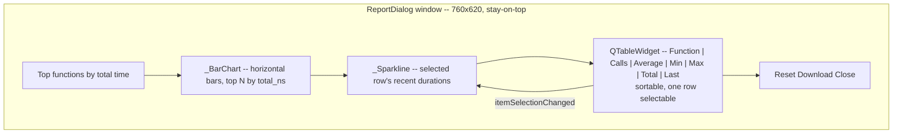
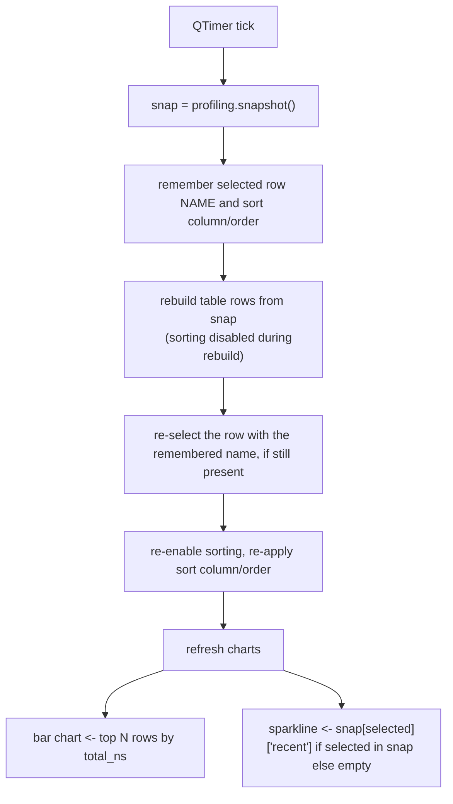

# Report -- Flow

**About:** [description](../__about/report.md)

## Layout

## Algorithm -- refresh cycle (every configured interval)

Selection is tracked by function NAME, never by row index -- the table
re-sorts every cycle, so an index-based "selected row" would silently
point at a different function a moment later.
