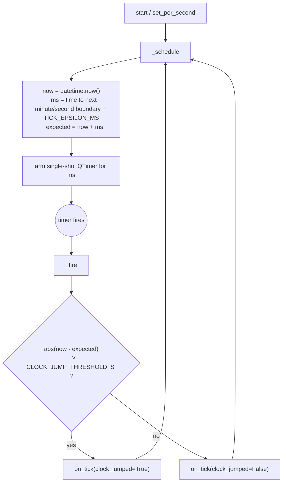

# Minute Scheduler — Flow

**About:** [description](../__about/scheduler.md)

## Algorithm — self-correcting reschedule

Pseudocode:

    FUNCTION _schedule():
        now <- wall clock, timezone-aware
        ms  <- milliseconds until the next minute (or second) boundary
              + TICK_EPSILON_MS
        expected <- now + ms
        arm single-shot timer for ms

    FUNCTION _fire():
        now <- wall clock
        jumped <- expected is set AND |now - expected| > CLOCK_JUMP_THRESHOLD_S
        TRY:
            on_tick(jumped)
        FINALLY:
            _schedule()   # always reschedule, even if on_tick raised

The interval is never accumulated — every `_schedule()` call reads the
wall clock fresh, so a late fire (machine slept, GUI thread was busy)
self-corrects on its own next pass rather than drifting cumulatively.
