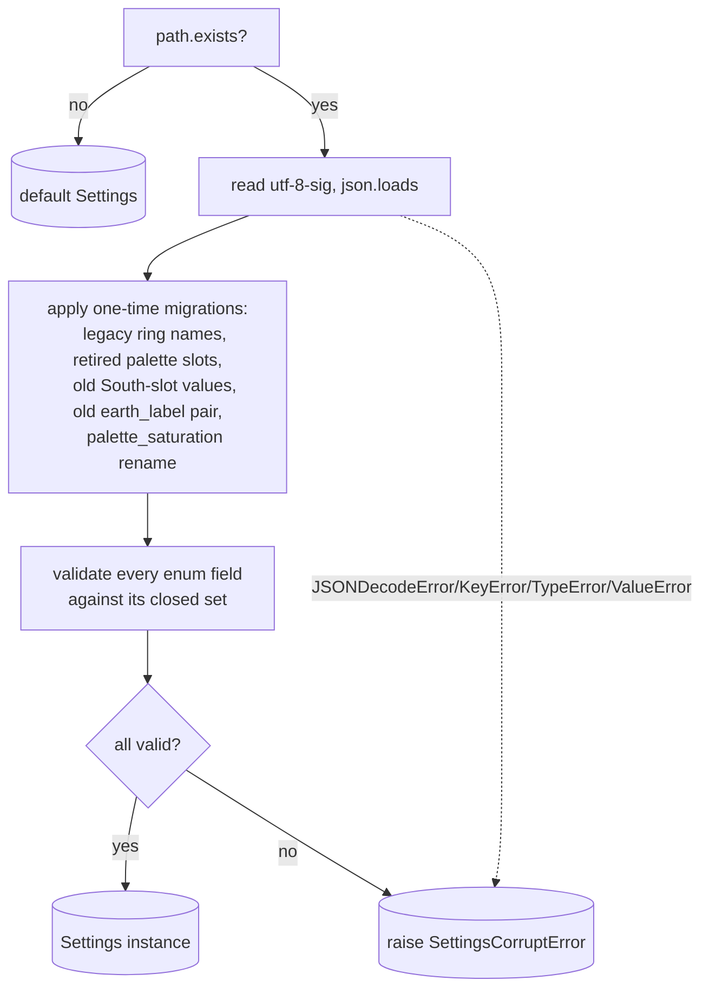

# Settings Store — Flow

**About:** [description](../__about/settings_store.md)

## The `Settings` field tree

```
Settings (frozen dataclass)
  schema_version
  Window
    window_x, window_y (None = never positioned)
    diameter
    click_through
    z_mode                       "bottom" | "normal" | "top"
  Ring
    ring, ring_tint, ring_finish
    custom_rings                 tuple of {name, positions, letters, thematic?}
    ring_two_metals              {preset_name: bool}
    ring_eye_shine               {preset_name: bool}
  Pointer / Wheel
    pointer, umbra_form, umbra_contrast
    palette_style                "primary" | "secondary" | "tertiary"
    calendar_mount
    archetype_mode, archetype_names, cube_look
    daylight
    pointer_shape, polygon_curvature, polygon_edge, hide_night_borders
    solar_rotation
  Slots (three, same shape)
    weekday_slot / octa_slot / third_slot        mode
    day_slot_style / info_slot_style / third_slot_style
    weekday_theme / info_slot_theme / third_slot_theme
    weekday_roster / info_slot_roster / third_slot_roster
    show_octa_slot, show_third_slot
    show_weekday_names, show_info_slot_names
  Earth
    earth_label, earth_style, earth_scale
  Complications
    subdial_style, subdial_set
  Metals
    metal_shade_gold, metal_shade_bronze, metal_shade_silver
    theme_metals {theme: metal}, theme_metal_follow_ring
  Art
    art_source, hands
  Elements (visibility)
    legend, show_earth, show_moon, show_weekday, show_pointer
    colorful, show_seconds
  Theme rotation
    theme_rotation_group, theme_rotation_minutes, theme_rotation_themes
  Language & calendar
    language
    era_notation, show_era_suffix, third_era
  Location
    city_name, city_path, latitude, longitude, timezone
    jump_cities                  tuple of {name, latitude, longitude, timezone}
  Sizing
    moon_scale, slot_scale, ring_letter_scale, hover_enlarge
  Saturation / opacity
    pointer_saturation, ring_saturation
    star_alpha, aura_day_alpha, aura_twilight_alpha
  Custom palettes
    palettes                     {"pointer_style": (hue, hue, ...)}
```

## Algorithm — `load()`



Pseudocode:

    FUNCTION load():
        IF file missing -> RETURN Settings()             # first-run default
        TRY:
            raw <- json.loads(file, encoding="utf-8-sig")
            migrate legacy ring names, retired palette slots,
                    old South-slot combo, old earth_label bool pair,
                    palette_saturation -> pointer_saturation
            FOR EACH enum field:
                IF raw value not in its allowed set -> raise ValueError
            RETURN Settings(**validated fields)
        EXCEPT (JSONDecodeError, KeyError, TypeError, ValueError) as exc:
            RAISE SettingsCorruptError(path, exc)          # caller must show it

    FUNCTION save(settings):
        payload <- settings as a plain dict
        write payload to path.tmp
        os.replace(path.tmp, path)                         # atomic
