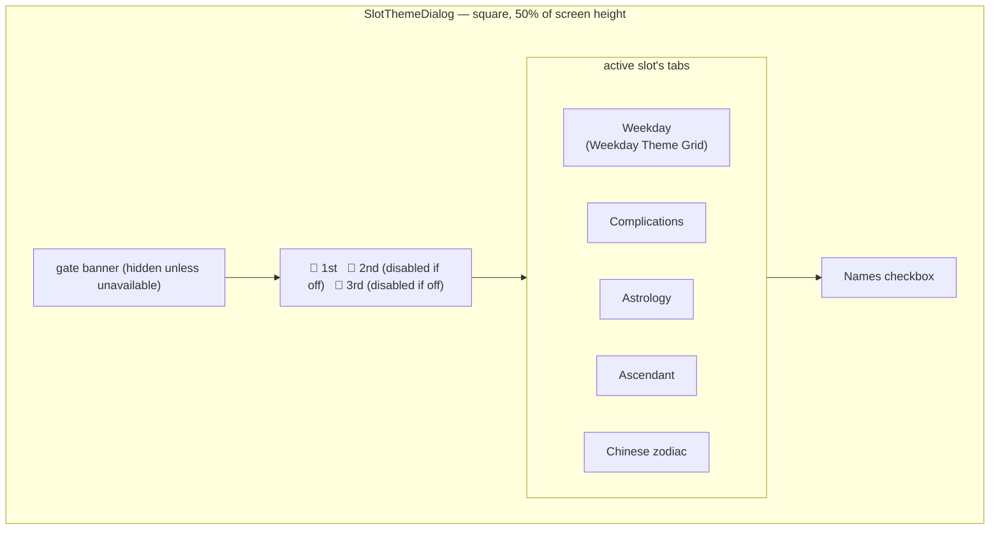
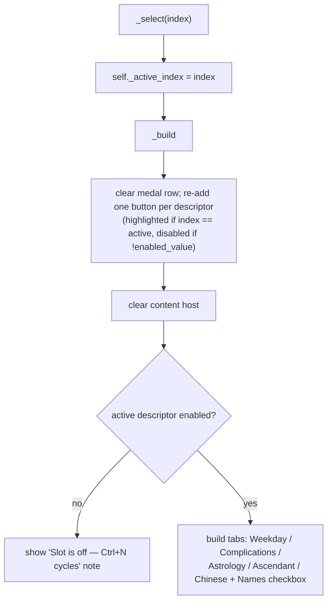

# Slot Theme — Flow

**About:** [description](../__about/slot_theme.md)

## Layout

## Algorithm — medal click / rebuild

Each tab's pick calls the active `SlotDescriptor`'s own setter
(`set_mode` / `set_style_mode` / `set_weekday` / `set_names`) directly —
there is no intermediate dialog state; the controller re-supplies a
fresh `refresh(descriptors)` after every pick so the highlighted choice
in every tab always matches the live `Settings`.
