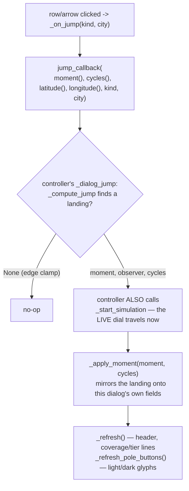

# Time Travel — Flow

**About:** [description](../__about/time_travel.md)

## Layout

```mermaid
%%{init: {'flowchart': {'subGraphTitleMargin': {'top': 0, 'bottom': 35}}}}%%
flowchart TB
    subgraph WIN["TimeTravelDialog — square, 50% of screen height, stay-on-top"]
        HEADER["dual-calendar header — bold, live"]
        MOMENT["Day  Month  Year  Era  HH:mm"]
        COORD["Latitude   Longitude"]
        NOTE["'shows this situation for N seconds...'"]
        COVER["Coverage line + Precision-tier line"]
        WARN["out-of-range warning (hidden unless triggered)"]
        subgraph JUMP["Quick Jump — QScrollArea (optional, jump_callback given)"]
            direction TB
            J1["← ☀️ Sun →"]
            J2["← 🌑 Solar Eclipse → (greyed w/o Deep Time pack)"]
            J3["← 🌙 Moon →"]
            J4["← 🌘 Lunar Eclipse → (greyed w/o pack)"]
            J5["← 📅 Day/Month/Year → · ← 🏛 Century/Millennium →"]
            J6["🧊 North Pole   🧊 South Pole   🧭 Greenwich"]
            J7["📍 user jump_cities..."]
        end
        BUTTONS["Now (blue)   OK (green)   Cancel"]
    end
    HEADER --> MOMENT --> COORD --> NOTE --> COVER --> WARN --> JUMP --> BUTTONS
```

## Algorithm — Quick Jump row click

## Algorithm — `accept()` (OK)

    FUNCTION accept():
        IF NOT target_within_coverage():
            build the refusal message (Laskar-tier reason if the Deep
                Time pack is installed, else "install the pack")
            show it inline, keep the dialog open, RETURN
        super().accept()      # closes with Accepted — the controller
                               # starts/refreshes the simulation from
                               # whatever the dialog's fields hold now
