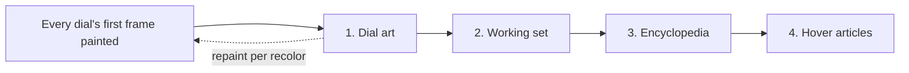

# Warm — Flow

**About:** [description](../__about/warm.md)

## Algorithm — the four ordered phases

Pseudocode:

    FUNCTION run_warm(hover_sweeps, progress, on_art_ready, should_stop):
        warm_pending_art(progress, on_art_ready, should_stop)      # phase 1
        IF should_stop() -> RETURN
        warm_working_set(progress)                                # phase 2
        IF should_stop() -> RETURN
        warm_encyclopedia(progress, should_stop)                  # phase 3
        FOR EACH sweep IN hover_sweeps:                            # phase 4
            IF should_stop() -> RETURN
            sweep()

1. **Dial art** — the jewel recolors the dials are currently standing
   in for with their gold masters; each lands with an immediate repaint
   via `on_art_ready` (a queued Qt signal, since this runs off the GUI
   thread).
2. **Working set** — the downscaled dial copies of oversized sources.
3. **Encyclopedia** — every metal variant and decode-ceiling downscale a
   page can ask for.
4. **Hover articles** — every spoken hover probe, last and only after
   the dials are dressed.

`should_stop` is polled between phases, never mid-phase — a daemon
thread dies with the process regardless, so the check only avoids
leaving a half-written cache file on the way out.

## The sweeps that arrive LATER

Phase 4 covers the STARTUP roster. A day change or a skin install asks
for a sweep long after this thread is gone, and those requests obey the
same rule through [Watch Manager](../__about/watch_manager.md)'s queue —
`request_hover_warm(watch)` appends, one `_drain_hover` worker serves:

    watch A day changes ─┐
    watch B day changes ─┼─> _hover_pending ─> ONE worker ─> sweep, sweep, …
    watch C day changes ─┘

Every watch used to start its own thread here instead. Five of them at
once, each 7,201 pure-Python probes, against five GUI threads, is what
froze the owner's dials for two minutes after a Windows time SYNC on
2026-08-06 — the very failure phase 4's ordering already existed to
prevent.
