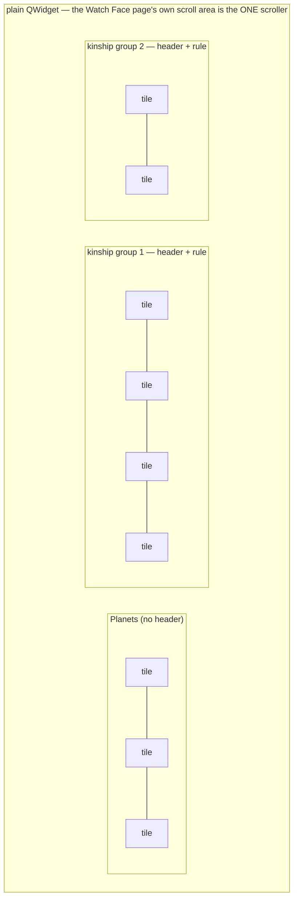
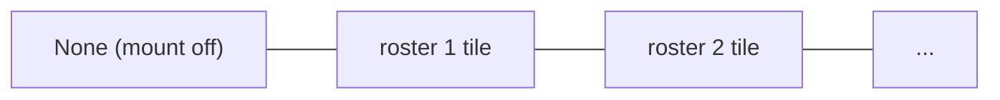

# Weekday Theme Grid — Flow

**About:** [description](../__about/weekday_theme_grid.md)

## Layout — `build_weekday_theme_grid`

Each tile is image-over-name (`ToolButtonTextUnderIcon`) at the shared
`widgets.TILE_ICON_PX` icon size, its plate resolved rotation-aware
(`_theme_icon`) and cached through `thumbs.art_thumbnail`; the tile
matching `current_theme` carries a 2px accent border. Every section's
row of tiles wraps at 4 columns, packed to the reading edge.

## Layout — `build_calendar_mount_grid`

Pseudocode:

    tiles <- [ tile("None", selected = current_mount == "off") ]
    FOR EACH (key, mount) IN calendar_mounts.CALENDAR_MOUNTS:
        preview <- plate of mount's FIRST member (or none if absent)
        label   <- "{mount.title} ({mount.seats})"
        tiles  += tile(label, preview, selected = key == current_mount)
    RETURN one section of these tiles, no header
