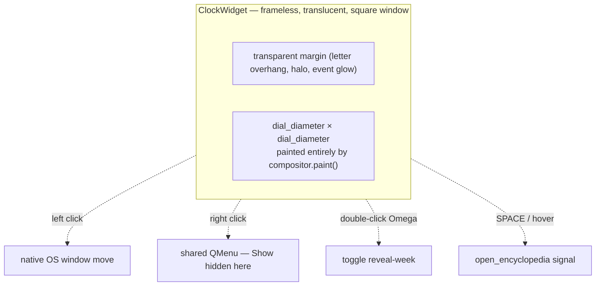
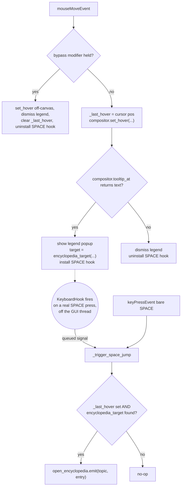

# Clock Widget — Flow

**About:** [description](../__about/widget.md)

## Layout



## Algorithm — key input dispatch (`keyPressEvent`)

```mermaid
%%{init: {'flowchart': {'subGraphTitleMargin': {'top': 0, 'bottom': 35}}}}%%
flowchart TB
    A[keyPressEvent] --> B{key == Space AND no modifier?}
    B -- yes --> C[_trigger_space_jump]
    B -- no --> D["held = modifiers & ~KeypadModifier"]
    D --> E{"(key, held) matches a
    SHORTCUTS entry?"}
    E -- yes --> F["shortcut_triggered.emit(action_id)"]
    E -- no --> G{event.text() printable?}
    G -- yes --> H["typed.emit(text)"]
    G -- no --> I[super().keyPressEvent — Qt default]
```

## Algorithm — hover / SPACE-without-focus



Both the focused path (`keyPressEvent`) and the unfocused path (the
native `KeyboardHook`, queued through `_space_pressed`) converge on the
SAME `_trigger_space_jump()` — the hook consumes SPACE at the OS level,
so the two paths can never double-fire.
