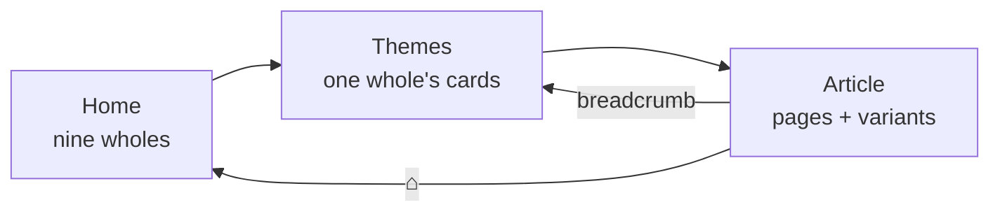

# encyclopedia/

The article BROWSER, on three levels. Owner rework — Session 27, sealed
2026-07-28 — which replaced the old two-screen browser (one gallery of
39 tiles in five halls → article slider) and split its single
2,766-line module into this package (root Rule #20: a file is one
cohesive unit of responsibility). The home screen grew from six wholes
to nine in Session 35 (2026-07-29) — a reseating, not a rework.

## Files

| File | Tier | One line |
|------|------|----------|
| `dialog.py` | Algorithmic | the window shell — header row, stack, navigation — [about](__about/dialog.md) · [flow](__flow/dialog.md) |
| `home.py` | Algorithmic | level one, the nine wholes, no scroll ever — [about](__about/home.md) · [flow](__flow/home.md) |
| `themes.py` | Algorithmic | level two, one whole's theme cards, vertical scroll only — [about](__about/themes.md) · [flow](__flow/themes.md) |
| `reader.py` | Algorithmic | level three, the article slider and its sizing algorithm — [about](__about/reader.md) · [flow](__flow/reader.md) |
| `cards.py` | Algorithmic | the shared card/grid, the width-formula pair, the computed mosaic — [about](__about/cards.md) · [flow](__flow/cards.md) |
| `tree.py` | Algorithmic | the topic table plus the Session 27 laws — [about](__about/tree.md) · [flow](__flow/tree.md) |
| `builders.py` | Algorithmic | theme key → (icon, entries) builders — [about](__about/builders.md) · [flow](__flow/builders.md) |
| `pages.py` | Algorithmic | static page tables — seasons, eras, eclipses, the Cube canon — [about](__about/pages.md) · [flow](__flow/pages.md) |
| `text.py` | Algorithmic | prose → HTML / display-name / tooltip resolution — [about](__about/text.md) · [flow](__flow/text.md) |
| `__init__.py` | Trivial | re-exports `EncyclopediaDialog` and `topics`, nothing else |

## Connections

### Uses
- [Encyclopedia Tree (config)](../../config/__about/encyclopedia_tree.md) — the
  ONE table of wholes, memberships, variants, aliases and accents
- [Encyclopedia Repository](../../data/__about/encyclopedia.md) — the wholes'
  and themes' own texts, and every article this browser shows
- [Symbolism Repository](../../data/__about/symbolism.md) — the dial's own
  article set, shared with the hover legends (Rule #5)
- [Theme](../__about/theme.md), [UI Style](../__about/ui_style.md) — the shared pills,
  look chips and dialog theming

### Used by
- [App Controller](../__about/controller.md) — opens and navigates the one live
  instance; the 📖 Guide menu entry opens this browser on the Guide card
- [Encyclopedia Warm](../__about/encyclopedia_warm.md) — walks `topics()` as its
  single inventory of derived art to pre-build

## Design Decisions

- **The tree is declared once, in config.** No screen re-declares a
  whole, a membership or an accent. `tests/test_encyclopedia_tree.py`
  pins that the built table matches the declaration EXACTLY — no ghost
  card, no unreachable topic.
- **A variant is a contiguous run of pages, never a re-ordering.** The
  merged cards build their source blocks exactly as before and record
  the boundaries, so nothing about an existing page changed when it
  joined a loop.
- **Two switchers, deliberately unalike.** The VARIANT switcher (beside
  the title) changes which register is being read; the LOOK switcher
  (inside the reader) changes the art register of the page in front of
  you. They never look the same.
- **The no-X-scroll law is enforced twice** — the geometry cannot
  produce an overwide row, AND every scroll area's horizontal bar is
  switched off. It has regressed twice before; one mechanism was not
  enough.
- **The window's minimum IS the owner's opening screen** (1280×720).
  That is what makes "the home screen never scrolls" a fact about
  geometry rather than a hope.
