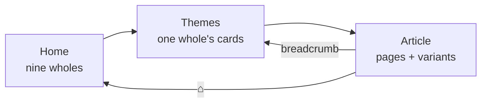

# encyclopedia/

The article BROWSER, on three levels. Owner rework — Session 27, sealed
2026-07-28 — which replaced the old two-screen browser (one gallery of
39 tiles in five halls → article slider) and split its single
2,766-line module into this package (root Rule #20: a file is one
cohesive unit of responsibility).

## Files

### `dialog.py` — The Window
The shell: the ONE header row — Home and the breadcrumb, the titled
VARIANT switcher, Download — the session zoom and the stack that shows
one of the three screens. Owns the jump entry point (`navigate_to`) the
dial's Spacebar and the tray menu both use.

### `home.py` — Level One
The nine wholes, 3×3, **no scroll area at all** — the strongest form of
the owner's "prvi ekran nema scroll". Each card wears its whole's Rose
(or, for the ninth, Moon-silver) accent, a computed mosaic of that
whole's own theme plates, its about line and a live count of what waits
inside.

### `themes.py` — Level Two
One whole's theme cards, up to four per row, wrapping. Vertical scroll
allowed, horizontal switched OFF outright.

### `reader.py` — Level Three
The page slider: the image row or grid, the bold name, the article, the
look/finish switcher and the pager (the Download BUTTON moved up to the
header row; `download_entry()` — the deed — stayed). Everything that
SIZES an article moved here verbatim — the block-width formula, the
em-like font growth, the image-height ceiling, the lazy decode cache and
THE INVISIBLE CLIPPER fix all carry ground-truthed owner bug fixes.

### `cards.py` — The Card
One card component and one grid for both gallery levels (Rule #5), plus
the row/card width pair that makes the no-X-scroll law geometric, and
the 2×2 mosaic that COMPUTES a whole's tile from its own theme plates
(root Rule #19 — a category image is derivable, so it is never
generated).

### `tree.py` — The Topic Table
`_build_topics` (the flat table, moved verbatim) plus the four Session 27
laws applied on top: the Cube split, the register merges, the god-block
labels and the `variants` seal. Also the pure reading helpers —
`variant_at`, `switch_variant` (THE OFFSET LAW) and `resolve_target` (the
jump contract).

### `builders.py` — The Topic Builders
The weekday skeleton every theme shares, the pantheon and wider-court
blocks the four god themes add, the Continents topic's custom build, and
the Guide topic built from the help book's own JSON.

### `pages.py` — The Static Page Tables
What pages exist and which plate each wears: seasons, sun, eras, both
eclipse families, the four Cube-canon sets and the emblem/week tables.

### `text.py` — Text Resolution
Article ref → prose, entry → display name, prose → reflowing HTML, path
→ image tooltip. No widgets; the reader, the Download path and the tests
all read through it.

## Connections

### Uses
- [Encyclopedia Tree](../../config/encyclopedia_tree.md) — the ONE table
  of wholes, memberships, variants, aliases and accents
- [Encyclopedia Repository](../../data/encyclopedia.md) — the wholes'
  and themes' own texts, and every article this browser shows
- [Symbolism Repository](../../data/symbolism.md) — the dial's own
  article set, shared with the hover legends (Rule #5)
- [UI Style](../ui_style.md), [Theme](../theme.md) — the shared pills,
  look chips and dialog theming

### Used by
- [App Controller](../controller.md) — opens and navigates the one live
  instance; the 📖 Guide menu entry opens this browser on the Guide card
- [Encyclopedia Warm](../encyclopedia_warm.md) — walks `topics()` as its
  single inventory of derived art to pre-build

## Design Decisions

- **The tree is declared once, in config.** No screen re-declares a
  whole, a membership or an accent. `tests/test_encyclopedia_tree.py`
  pins that the built table matches the declaration EXACTLY — no ghost
  card, no unreachable topic.
- **A variant is a contiguous run of pages, never a re-ordering.** The
  merged cards build their source blocks exactly as before and record
  the boundaries, so nothing about an existing page changed when it
  joined a loop.
- **Two switchers, deliberately unalike.** The VARIANT switcher (beside
  the title) changes which register is being read; the LOOK switcher
  (inside the reader) changes the art register of the page in front of
  you. They never look the same.
- **The no-X-scroll law is enforced twice** — the geometry cannot
  produce an overwide row, AND every scroll area's horizontal bar is
  switched off. It has regressed twice before; one mechanism was not
  enough.
- **The window's minimum IS the owner's opening screen** (1280×720).
  That is what makes "the home screen never scrolls" a fact about
  geometry rather than a hope.
