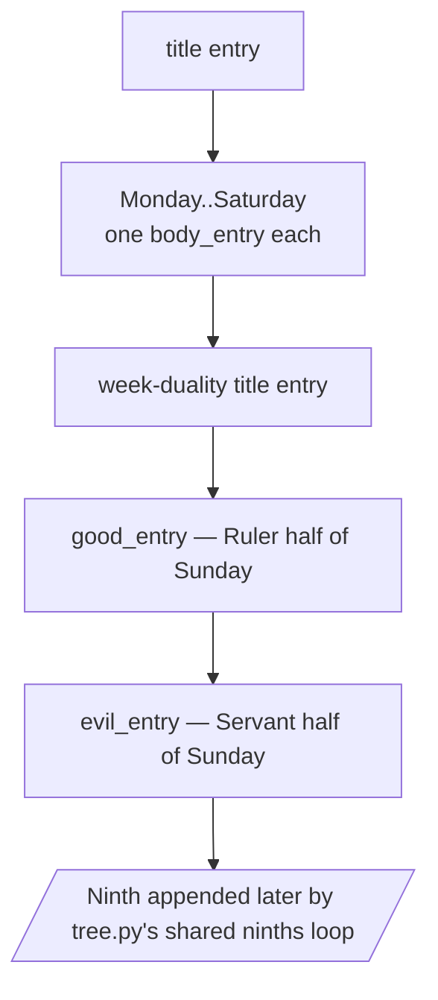

# Topic Builders — Flow

**About:** [description](../__about/builders.md)

## Algorithm — `_weekday_topic(theme, travel_date)`

Pseudocode:

    FUNCTION _weekday_topic(theme, travel_date):
        metal        <- theme IN METAL_THEMES
        mandate_date <- travel_date IF theme's ninth mechanism is "term_weekly" ELSE None
        entries <- [title_entry]
        FOR body IN Monday..Saturday:
            entries.append( body_entry(body) )       # looks_for() cycles metal/planet looks
        entries += [duality_title_entry, good_entry(mandate_date), evil_entry(mandate_date)]
        RETURN theme's own "sun" plate, entries

    FUNCTION looks_for(body, on_date):
        IF metal theme:  RETURN Colored/Bronze/Gold/Silver looks, each ONE image
        IF theme == "planets": RETURN Planets / Signs / Art looks
        ELSE: RETURN a single unlabeled look

## Algorithm — `_live_ninth_face` (THE DOUBLE NINTH LAW)

    FUNCTION _live_ninth_face(theme, name, plate, is_daylight, travel_date):
        mechanism <- NINTH_MECHANISMS.get(theme)
        IF mechanism == "daynight" AND NOT is_daylight:
            RETURN the night face (name, plate) from WEEKDAY_THEME_NINTH_NIGHT
        IF mechanism == "term_weekly":
            RETURN name, rotating_art_file(plate, travel_date) OR plate
        RETURN name, plate                            # every other theme: unchanged

## Algorithm — `_pantheon_topic(theme)`

Same 11-page shape as `_weekday_topic`, sourced through the safety law:

    FOR body IN Monday..Saturday:
        seat <- pantheon.pantheon_seat(theme, body)
        IF seat found: use its OWN plate + name + article
        ELSE:          fall back to the WHOLE planetary bundle (never mix)
    Sunday pair: IF the pantheon dual plate is missing,
                 BOTH Ruler and Servant fall back to planetary together

## Algorithm — `_continents_topic(travel_date)`

    entries <- [title, Monday..Saturday continent bodies (4 looks each:
                Atmosphere / Atmosphere·Night / Clean / Clean·Night),
                duality title, south_pole (Ruler), north_pole (Servant)]
    pangea  <- core.continents.ninth_is_pangea_from_repos(travel_date, seasons, moon)
    ninth   <- Pangea entry IF pangea ELSE Zealandia (The Unfound) entry
    entries.append(ninth)
