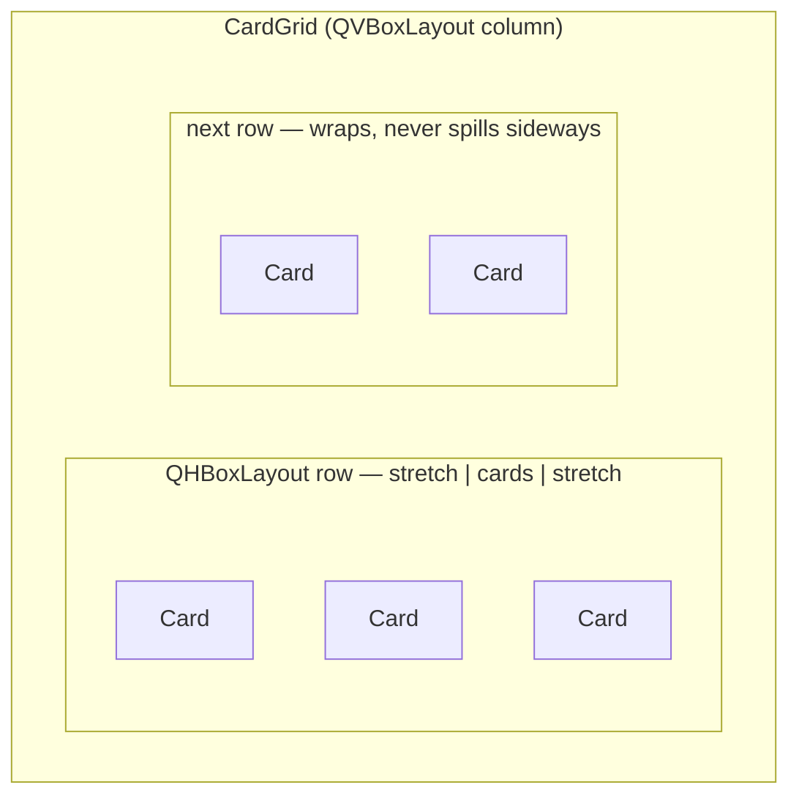

# Card — Flow

**About:** [description](../__about/cards.md)

## Layout sketch — one `Card`

```
📦 Card (QFrame, accent-tinted hairline; lit border + wash on hover)
  🖼️ image        — the plate, stretch 1
  🔤 title        — bold, wrapped
  📝 about        — secondary color, wrapped
  🔢 footer       — accent color, hidden when empty
```

## Layout sketch — `CardGrid`



## Algorithm — the width pair (Rule #5, one formula two directions)

    row_content_width(card_width, columns):
        RETURN columns * card_width + (columns - 1) * gap + margins

    card_width_for(viewport_width, columns):          # the exact inverse
        available <- viewport_width - margins - (columns - 1) * gap
        RETURN max(CARD_MIN_WIDTH, available / columns)

## Algorithm — `mosaic_pixmap(icons)` (root Rule #19: computed, never generated)

    plates <- first 4 icons that decode to a non-null pixmap
    IF no plates: RETURN null pixmap          # graceful-absent
    columns <- 1 if len(plates) == 1 else 2
    rows    <- 1 if len(plates) <= 2 else 2
    FOR EACH plate, at (row, column) in reading order:
        scale plate to its cell, keeping aspect ratio
        draw centered inside that cell of a transparent square canvas
    RETURN canvas

One plate fills the square alone; two split it side by side; three
leave the fourth quarter empty; four fill all quarters.

## Algorithm — `CardGrid.fit(viewport_width, viewport_height, zoom)`

    width  <- card_width_for(viewport_width, columns), clamped to [MIN, natural] * zoom
    font   <- clamp(width * FONT_RATIO * zoom, BASE, MAX)
    IF viewport_height given:                  # home screen — must not scroll
        rows   <- ceil(card_count / columns)
        height <- max(MIN_HEIGHT, (viewport_height - gaps) / rows)
    ELSE:                                       # theme screen — scrolls
        height <- None                          # each card keeps its natural height
    FOR EACH card: card.fit(width, height, font)
