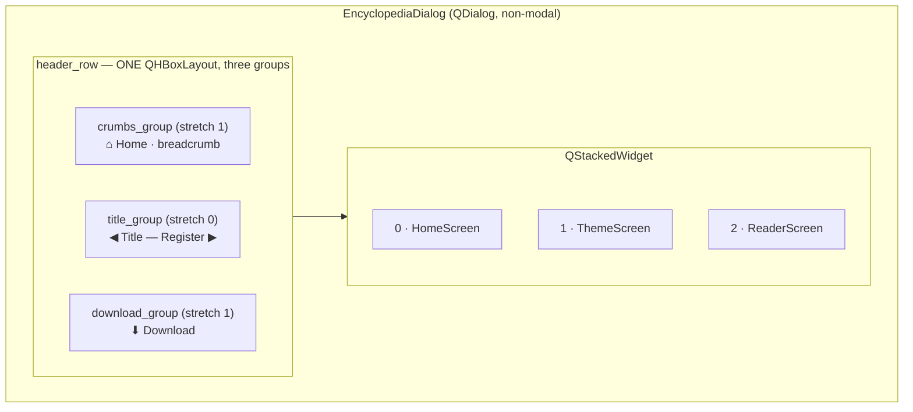
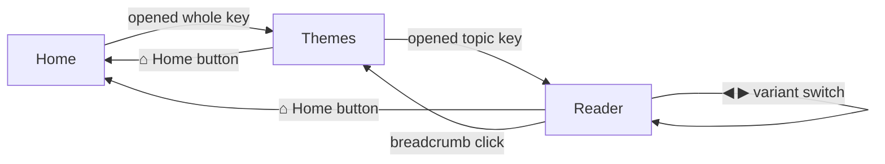

# Encyclopedia Dialog — Flow

**About:** [description](../__about/dialog.md)

## Layout sketch

## Navigation state machine

## Algorithm — `navigate_to(topic, entry)`

    IF topic is None: RETURN                 # plain re-open, leave the window where it is
    target <- resolve_target(topics, topic, entry)
    IF target is None: RETURN                 # unknown/stale key, never raises
    key, index <- target
    reader.open_topic(key, index)
    stack.currentIndex <- READER
    reader.set_zoom(zoom)
    refresh_header()

## Algorithm — `_refresh_header()`

    screen <- stack.currentIndex
    home_button.visible <- screen != HOME
    download.visible    <- screen == READER
    MATCH screen:
        HOME    -> crumbs = "", title = "Encyclopedia"
        THEMES  -> crumbs = "› {whole.title}", title = whole.title, accent = whole.accent
        READER  -> crumbs = "› {whole.title}"
                   title  = "{topic.title}" (+ " — {register label}" if >1 variant)
                   accent = whole.accent
    variant_buttons.visible <- (screen == READER AND topic has >1 variant)
