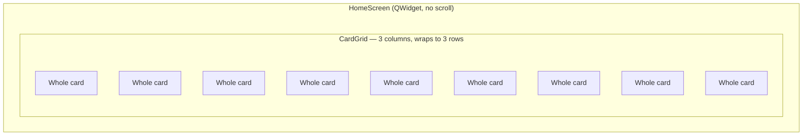

# Home Screen — Flow

**About:** [description](../__about/home.md)

## Layout sketch

No scroll area anywhere on this screen — the 3x3 grid IS the whole
widget, sized to fit the window exactly (owner law: "the first screen
never scrolls").



One card's own zones (shared `Card` widget, see [Card (flow)](cards.md)):

```
📦 Whole card
  🖼️ plate — hand-drawn PNG, or a computed 2x2 mosaic of the whole's own theme icons
  🔤 title — the whole's name, Rose-accented (or Moon-silver for the ninth)
  📝 about — one line
  🔢 footer — "N themes · M pages"
```

## Sizing algorithm

    ON resize/zoom:
        width  <- HomeScreen.width()
        height <- HomeScreen.height()
        CardGrid.fit(width, height, zoom)   # pins every card's size —
                                             # never reports it upward as
                                             # a minimum (QSizePolicy.Ignored)

The dialog's own 1280x720 minimum is the only floor; the grid measures
DOWN from whatever size the window already is.
