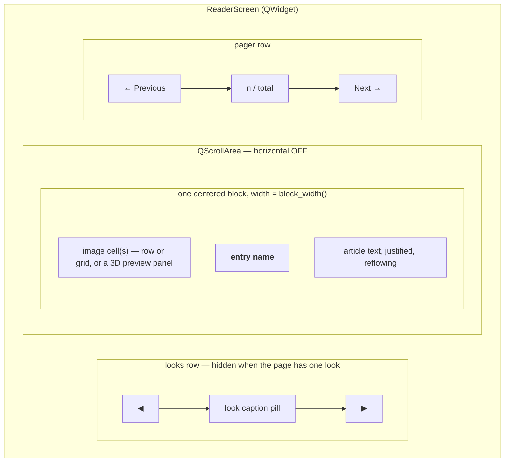

# Reader Screen — Flow

**About:** [description](../__about/reader.md)

## Layout sketch

## Algorithm — `_show_entry()`

    entry <- topic.entries[entry_index]
    counter.text <- "{entry_index+1} / {len(entries)}"
    looks <- entry.looks OR a single unlabeled look from entry.images
    look_rows <- FOR EACH look: resolve every path that exists or is a
                 pending metal variant (a pending path counts as present)
    DROP any look with zero resolved rows
    look_state <- {looks: look_rows, titles, index: preferred label if offered else 0}
    IF diagram key on entry:
        panel <- cube_preview3d.build_widget(kind, key)     # tried FIRST
        IF panel is not None: show the live 3D panel
        ELSE: show a QLabel, filled lazily by diagrams.plate() in _rescale
    build the name label and the article text label (poem entries render
        centered stanzas instead of justified prose)
    _rescale()                        # BEFORE setWidget — THE INVISIBLE CLIPPER fix
    scroll.setWidget(content)
    scroll.verticalScrollBar <- 0
    emit page_changed

## Algorithm — `_block_width()` / `_rescale()`

    block_width <- min(viewport_width,
                        viewport_width * TEXT_WIDTH_FRACTION * zoom)
    font_px     <- clamp(BASE_FONT + (viewport_width - FONT_BASE_WIDTH) * FONT_GROWTH, BASE, MAX) * zoom
    FOR EACH text label:
        set a real QFont (not a stylesheet — a stylesheet only takes
            effect on the NEXT style polish, too late for heightForWidth)
        label.setFixedHeight( label.heightForWidth(block_width) )
    diagram_side <- min(block_width, viewport_height * IMAGE_MAX_HEIGHT_FRACTION * zoom)
    re-fit every diagram plate / 3D panel to diagram_side
    FOR EACH image-cell state: _resize_cell (never rebuilds the grid)

## Algorithm — `_pixmap(path)`, the lazy decode cache

    IF path already decoded: RETURN the cached QPixmap
    ensure_variant(path)                       # materializes a pending metal variant
    ready  <- scaled_variant_file(path, ceiling, build=False)   # pre-warmed downscale, never a cold build here
    image  <- QImage(ready), downscaled further if still over the ceiling
    cache[path] <- QPixmap.fromImage(image)
    RETURN cache[path]

## Algorithm — `_cycle_look(step)`

    IF no look_state: RETURN
    look_state.index <- (look_state.index + step) MOD len(looks)
    preferred_look_label <- the newly selected look's title   # rides every following page
    update the caption pill's fill/text
    _render_cell(look_state, block_width())    # rebuild only THIS look's grid
