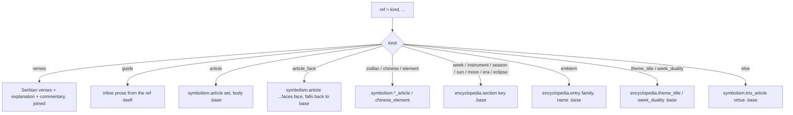

# Text Resolution — Flow

**About:** [description](../__about/text.md)

## Algorithm — `article_text(ref, ...)`, the one dispatch every page reads through

Pseudocode:

    FUNCTION article_text(ref, symbolism, encyclopedia, tr):
        kind <- ref[0]
        MATCH kind:
            "verses"       -> join(verses, explanation, commentary)
            "guide"        -> ref[1]                       # already localized prose
            "article"      -> symbolism.article(set, body).base
            "article_face" -> symbolism.article(set, body).faces[face] OR .base
            "zodiac" | "chinese" | "element" -> the matching symbolism lookup
            "week" | "instrument" | "season" | "sun" | "moon" | "era" | "eclipse"
                           -> encyclopedia.<kind>(key).base
            "emblem"       -> encyclopedia.entry(family, name).base
            "theme_title" | "week_duality" -> encyclopedia.<kind>(key).base
            DEFAULT        -> symbolism.trio_article(virtue).base

## Algorithm — `flow_html(text, tr)`

    strip every _HEX_NOTE occurrence
    FOR EACH paragraph IN text split on blank lines:
        IF paragraph starts with a [[Subhead]] marker:
            emit a centered bold heading (label translated via tr)
            paragraph <- the remainder after the marker
        emit paragraph, justified, with spine terms bolded (_highlight_terms)
    wrap the whole result in one 

