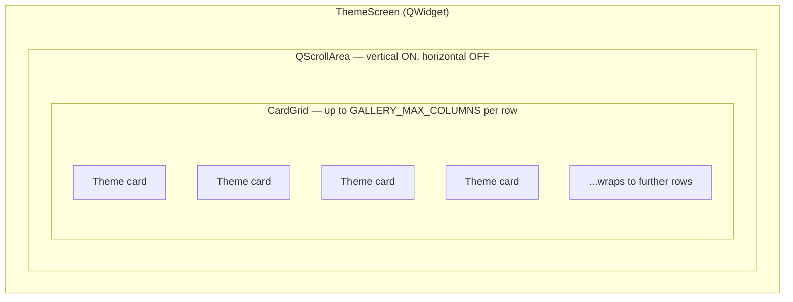

# Theme Screen — Flow

**About:** [description](../__about/themes.md)

## Layout sketch

Card zones are the shared `Card` widget — see [Card (flow)](cards.md).

## Algorithm — `show_whole(key)`

    ON show_whole(key):
        whole <- WHOLE_BY_KEY[key]
        cards <- [spec(theme) FOR theme IN whole.themes IF theme has a topic]
        CardGrid.set_cards(cards)
        fit()
        scrollbar.value <- 0     # every whole opens scrolled to the top

## Algorithm — `fit(zoom)`

    width <- scroll.viewport().width()
    CardGrid.fit(width, height=None, zoom)   # height=None -> rows keep
                                              # their natural height and
                                              # the scroll area absorbs
                                              # whatever does not fit
