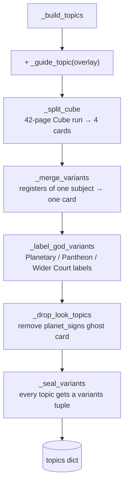
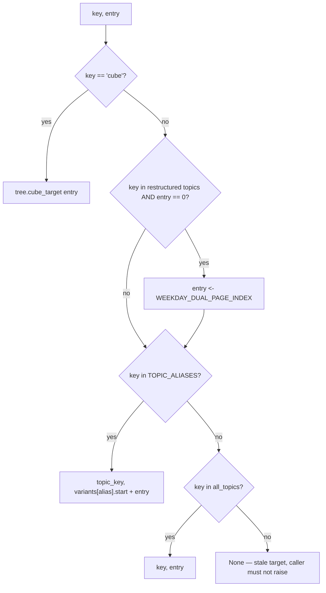

# Topic Tree — Flow

**About:** [description](../__about/tree.md)

## Algorithm — `topics()` build pipeline

Order matters: the Cube split must run before the merges/seal see the
four Cube cards; the seal must run last so every topic — merged or not
— ends up with a `variants` tuple.

## Algorithm — THE OFFSET LAW (`switch_variant`)

    FUNCTION switch_variant(topic, index, delta):
        variants <- topic.variants
        current  <- variant_at(topic, index)          # which register index sits in
        offset   <- index - variants[current].start
        next     <- (current + delta) MOD len(variants)
        RETURN variants[next].start + MIN(offset, variants[next].length - 1)

Monday stays Monday when the register changes; a shorter register (the
Wider Court runs 4 pages against Planetary's 11) clamps to its own last
page instead of overrunning into the next block.

## Algorithm — `resolve_target(topics, key, entry)`

