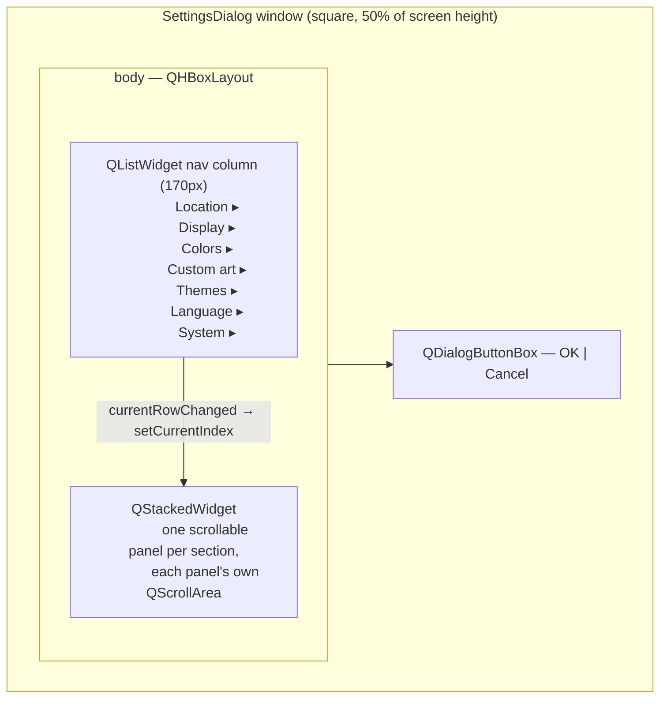

# Settings Dialog — Flow

**About:** [description](../__about/dialog.md)

## Layout

Each panel hosts that section's group boxes — built by the six mixins (see
the [folder doc](../___settings_dialog.md)'s layout table for which groups
belong to which section).

## Lifecycle (pseudocode)

    ON open(settings, skin, overlay):
        build 7 (title, [group_boxes]) sections from the 6 mixins
        FOR EACH section:
            add nav row "title ▸"
            wrap its groups in a scrollable panel, add to the stack
        wire nav.currentRowChanged -> stack.setCurrentIndex
        select nav row 0
        size window: square at 50% of screen height,
                     width = max(content width, nav width + panel floor)
        IF settings.city_path exists:
            restore the combo cascade to that path
        re-seed city_name / timezone / latitude / longitude from settings
            (the combo cascade must NOT silently win over the stored values)
        arm suggestion popups — only react to USER input from here on

    ON OK (accepted):
        result_settings() collects every mixin's widget state into one
        new frozen Settings; the caller (Watch Controller) applies it

    ON done(result):                      # both OK and Cancel funnel here
        release the location repository's tree
        proceed with the normal QDialog close
