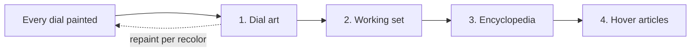

# Warm

**Script:** [Warm (script)](warm.py)

## Purpose

The **one** background warm for the whole process, walked in the order
the owner asked for.

Owner ruling 2026-07-28:

> zašto bi se stvari učitavale više puta za svaki sat kada svi dele iste
> ??? čovjek dakle samo 1 treba da se učitava u ram u slike ili god !!!

Every watch used to start its own warm thread in its own `run()`. Three
watches therefore walked the same 795 working-set files, the same 698
Encyclopedia paths and the same 7,201 hover probes three times over —
plainly visible in the owner's startup log, where every progress line
printed two and three times:

```
[12.2s] working set 10/795 (1%)      <- watch 1
[12.3s] working set 10/795 (1%)      <- watch 2, same files
```

The watches read one asset tree, write one raster cache and (since the
same round) share one [Asset Cache](../render/assets.md). The work is
shared too.

## The order



1. **Dial art** ([Art Warm](../render/art_warm.md)) — the letter recolors
   the dials are currently standing in for with their gold masters. Each
   one repaints the dial the moment it lands. First, because it is the
   only phase whose output the user is looking at right now.
2. **Working set** — the downscaled dial copies of oversized sources.
3. **Encyclopedia** — every metal variant and decode ceiling a page can
   ask for.
4. **Hover articles** — **last**, and only after the dials are dressed
   (owner: *"HOVER odloži dok se ne učita"*).

Why hover is last is measured, not aesthetic. It is the one phase that is
pure Python: 7,201 probes through the real `tooltip_at` dispatch, ~0.88 ms
each (from the owner's own profiling store: `Hover text`, 407,926 calls /
357.89 s). Python holds the GIL, so those ~6 s per watch come straight out
of the GUI thread's share — a benchmark on this machine measured 3 threads
of Qt image work finishing 3× the work in 0.93× the time (the GIL is
released around the C++ call) against 3.10× for pure Python (it is not).
The image phases genuinely run in parallel; the hover sweep genuinely
competes. Running it first is what made a freshly launched dial feel
stuck.

The sweeps also run one after another, never in parallel — N concurrent
Python sweeps would be exactly the wrong direction.

## When it starts

Not in `run()`. [Watch Manager](watch_manager.md)'s `_arm_warm` waits for
**every** watch's `first_painted`, for two reasons:

- the frame the user is waiting for gets the machine to itself;
- a dial's paint is what *records* which derived files it wants, so
  waiting is also what makes the ledger complete.

## Connections

### Uses
- [Art Warm](../render/art_warm.md) — phase 1
- [Asset Variants](../render/asset_variants.md) — phase 2
- [Encyclopedia Warm](encyclopedia_warm.md) — phase 3
- [Compositor](../render/compositor.md) — phase 4, through each watch's
  `hover_sweep()`

### Used by
- [Watch Manager](watch_manager.md) — owns the thread and arms it

## Design Decisions

**Why a free function and not a class.** It holds no state: the phases
are ordered calls, and everything they need is passed in. The thread, the
roster and the stop flag belong to the manager.

**Why `should_stop` is checked between phases.** Exit must not wait for a
90-second cold walk to finish. The thread is a daemon and would die with
the process anyway; the check just means it dies between files rather
than mid-write.
