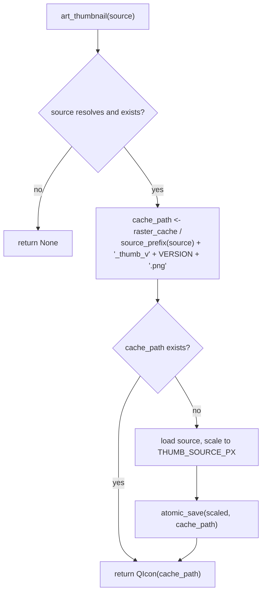
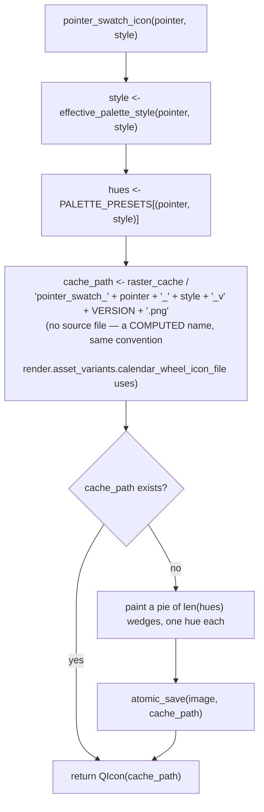

# Watch Face Thumbnails — Flow

**About:** [description](../__about/thumbs.md)

## Algorithm — art_thumbnail(source)

## Algorithm — pointer_swatch_icon(pointer, style) — the R-33 honest fallback

