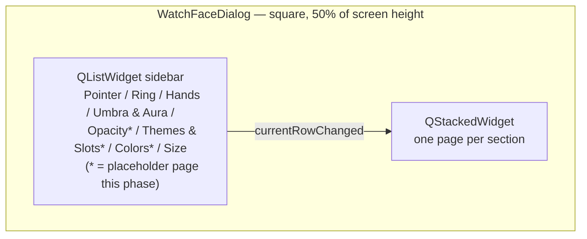
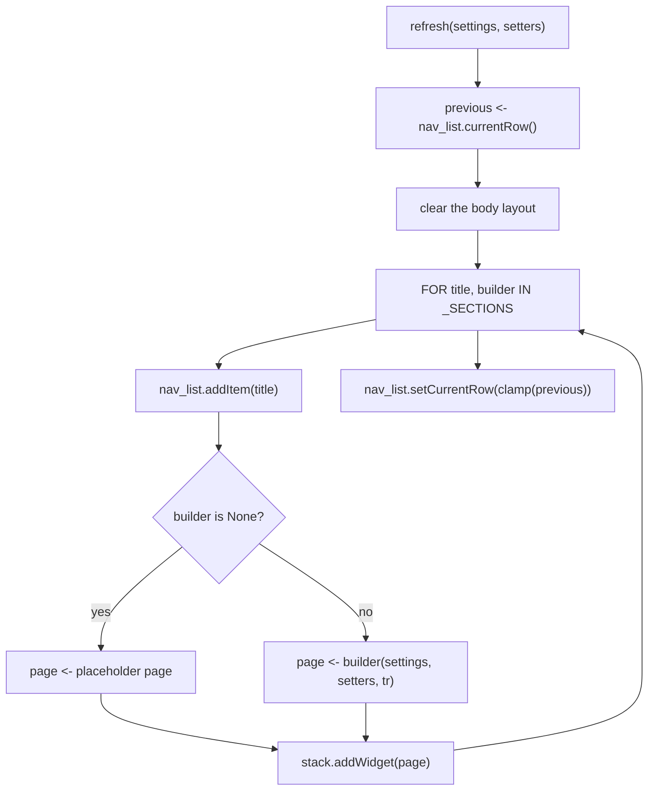

# Watch Face Window — Flow

**About:** [description](../__about/window.md)

## Layout

## Algorithm — rebuild on every pick

    FUNCTION _build():
        previous <- nav_list.currentRow() if nav_list exists else 0
        clear the body layout (old nav_list/stack deleteLater)
        nav_list, stack <- fresh QListWidget, QStackedWidget
        FOR title, builder IN _SECTIONS:
            nav_list.addItem(tr(title))
            page <- placeholder_page(tr) IF builder is None
                    ELSE builder(settings, setters, tr)
            stack.addWidget(page)
        nav_list.currentRowChanged -> stack.setCurrentIndex
        nav_list.setCurrentRow(clamp(previous, 0, count-1))
