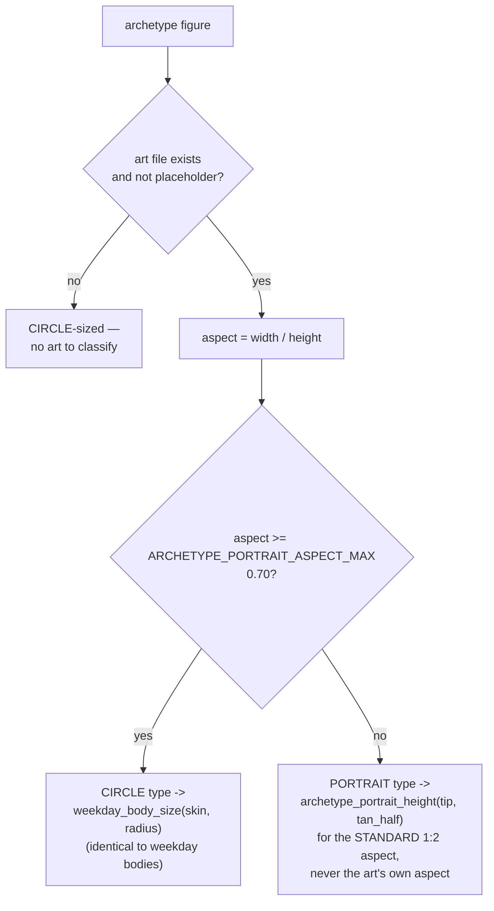
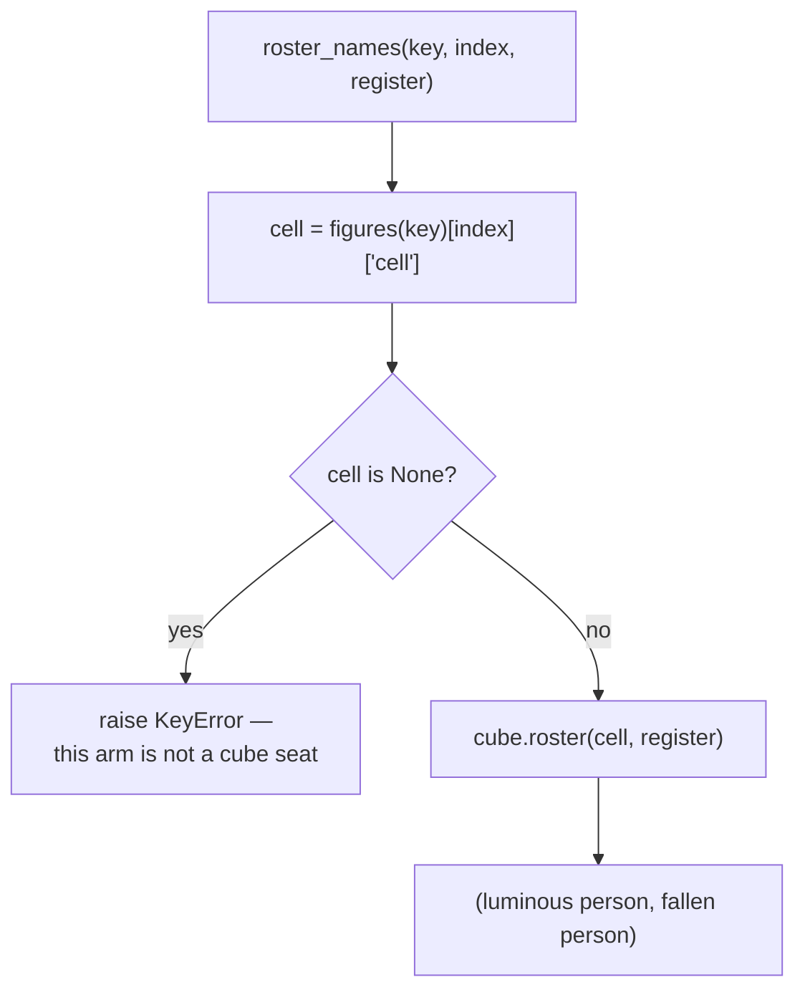

# Archetypes — Flow

**About:** [description](../__about/archetypes.md)

## The grid

```
📁 ARCHETYPE_GRID  (pointer, palette_style) -> archetype key
  (trio, primary)     -> trinity_primary
  (trio, secondary)   -> trinity_secondary
  (trio, tertiary)    -> trinity_genesis
  (cross, primary)    -> quaternity_primary
  (cross, secondary)  -> quaternity_secondary
  (cross, tertiary)   -> [absent — no archetype yet]
  (hexa, primary)     -> prism_primary
  (hexa, secondary)   -> prism_secondary
  (hexa, tertiary)    -> prism_council
  (octa, primary)     -> compass_primary
  (octa, secondary)   -> compass_secondary
  (octa, tertiary)    -> compass_character
  (rose, primary)     -> compass_character   (reuse — same wheel, Rule #5)
  (rose, secondary)   -> rose_vertices
  (aurora, *)         -> [absent]
  (calendar, *)       -> [absent]
```

## Each archetype entry's shape

```
ARCHETYPES[key] = {
  "articles": "<symbolism.json article-set key>",
  "figures": ( _fig(angle, file, name, row2, entity, enc=None,
                     rotates=False, cell=None), ... )
             — OR —
  "registers": { register_name: figures_tuple, ... }   # compass_secondary only
  "center": { "file", "name", "entity", "enc"? } | None
}
```

## Figure size classification



## Roster name resolution (Cube wheels only)



Only `compass_character` and `rose_vertices` populate `cell` on every
row; every other archetype's rows leave it `None`, so calling
`roster_names` on them always raises rather than guessing.

## Center lighting window

    archetype_center_lit(hour_hand_angle):
        distance <- circular_distance(hour_hand_angle, noon_or_midnight_axis)
        RETURN distance <= ARCHETYPE_CENTER_WINDOW_DEG   # 15.0 = ±1h

    IF lit: draw center FULL opacity
    ELSE:   draw center at weekday ghost_opacity (same as an un-lit arm figure)
    the reveal gesture always forces FULL, regardless of the window
