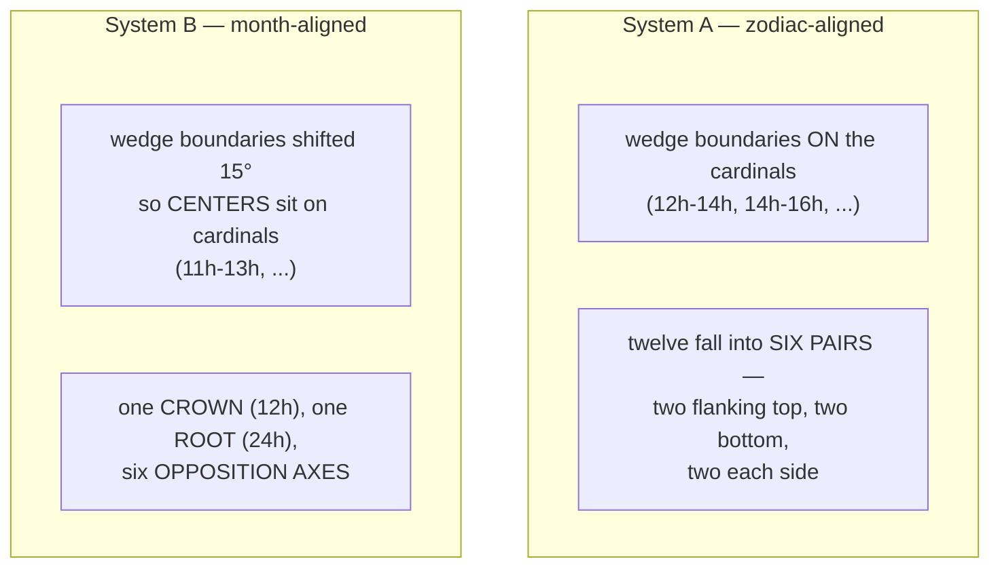
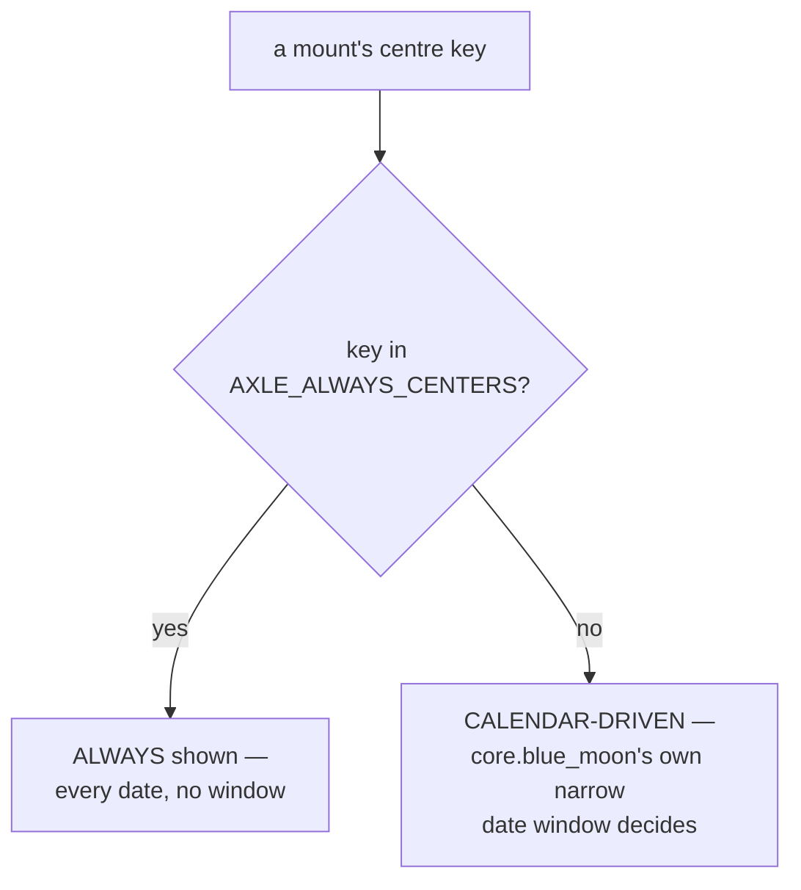

# Calendar Mounts — Flow

**About:** [description](../__about/calendar_mounts.md)

## The registry

```
📁 CALENDAR_MOUNTS (10 rosters)
  zodiac     System A   12   centre=ophiuchus     follows=sign
  almanac    System B   12   centre=sol           follows=month
  months     System B   12   centre=modrenik      follows=month   (Slavic)
  chinese    System B   12   centre=chinese       follows=month
  emotions   System B   12   centre=peace         follows=None
  olympians  System A   12   centre=hestia
  apostles   System A   12   centre=jesus
  virtues    System B   12   centre=prudence
  vices      System B   12   centre=cunning
  sins       System B   12   centre=hardness_of_heart
```

Each `CalendarMount` also carries `art_dir` (a subdir of
`assets/calendars/`) and, where the plate filename differs from the
display name, `art_stems` in the same seat order.

## System A vs System B geometry



## Centre appearance law



## Seat law (one formula, no per-seat table)

    calendar_mount_angle(seat_index, wedge_count, seats_per_wedge, slot):
        wedge_width <- 360 / wedge_count
        IF seats_per_wedge == 1:
            RETURN seat_index * wedge_width         # wedge centre
        ELSE:  # seats_per_wedge == 2 (a 24-set)
            offset <- wedge_width / 4                # a 15° pitch
            RETURN seat_index * wedge_width + (slot == 0 ? -offset : +offset)
