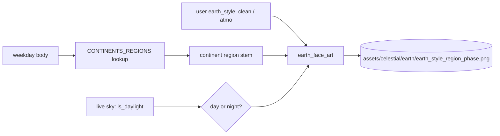

# Continents — Flow

**About:** [description](../__about/continents.md)

## The region table

```
CONTINENTS_REGIONS (body -> continent stem)
  moon    -> oceania
  mars    -> europe
  mercury -> asia
  jupiter -> africa
  venus   -> south_america
  saturn  -> north_america
  sun     -> south_pole        (Antarctica, the Ruler face)

CONTINENTS_DUAL_REGION -> north_pole   (the Arctic, the Servant face)
```

## Face resolution

```
earth_face_art(style, region, phase):
    RETURN EARTH_ART_DIR / "earth_{style}_{region}_{phase}.png"

continents_body_art(body, earth_style, is_daylight):
    region <- CONTINENTS_REGIONS[body]
    phase  <- "day" IF is_daylight ELSE "night"
    RETURN earth_face_art(earth_style, region, phase)

continents_dual_art(earth_style, is_daylight):
    phase <- "day" IF is_daylight ELSE "night"
    RETURN earth_face_art(earth_style, CONTINENTS_DUAL_REGION, phase)
```



Both style (`clean`/`atmo`, a user setting) and phase (`day`/`night`,
the live sky) are supplied by the caller at every render — this module
never re-derives them; it only maps a body/dual to its region and
assembles the filename.
