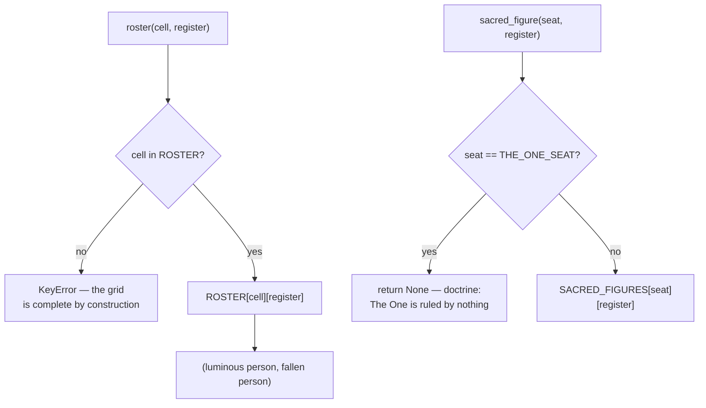

# Character Cube — Flow

**About:** [description](../__about/cube.md)

## The thirteen axes, by family

```
📁 AXES (13, Sacred Axis first)
  Tertiary — 4 vertex axes (all three coordinates ±1)
    The Sacred Axis         (-1,-1,-1) Contemplative Sage / Paralyzed Purist
                             (+1,+1,+1) Charismatic Champion / Tribal Warlord
    Vow <-> Vision           (-1,+1,-1) / (+1,-1,+1)
    Preservation <-> Revolution (-1,+1,+1) / (+1,-1,-1)
    Crown <-> Shield          (-1,-1,+1) / (+1,+1,-1)

  Primary — 3 face axes (one coordinate ±1, other two 0)
    Activation      (-1,0,0) Composure / Lethargy      (+1,0,0) Vigor / Frenzy
    Moral Scope     (0,-1,0) Integrity / Legalism       (0,+1,0) Loyalty / Tribalism
    Self-Regard     (0,0,-1) Humility / Self-Annihilation (0,0,+1) Dignity / Self-Worship

  Secondary — 6 edge axes (two coordinates ±1, one 0)
    Reason <-> Emotion, Pragmatism <-> Idealism, Person <-> Cause,
    Hearth <-> Desert, Lion <-> Lamb, Servant <-> Sovereign
```

`THE_ONE` sits at `(0,0,0)`, the centre every axis passes through.

## The roster lookup



`ROSTER` is keyed by the SAME `(x, y, z)` coordinate tuples `AXES`
uses — a seat's roster, hue, family, kin and antipode all answer from
one key, never a second lookup table.

## The two seatings

```
ROSE_24_SEATING: the 24 human cells, ray 0 = 12h, one ray every 15° CW
  ray % 4 == 0  -> a POLE     (hexagram pairs: 12h-24h, 4h-16h, 20h-8h)
  ray % 4 == 2  -> a CORNER
  odd ray       -> an EDGE
  (the single survivor of an exhaustive search under 5 symmetry laws —
   core.cube_seating re-derives it, never trusts the constant)

CALENDAR_WEDGES_BY_FAMILY (the hexagram figure, on the 12-wedge Almanac):
  primary   arms -> wedges 0, 4, 8   (June/October/February — a triangle)
  tertiary  arms -> wedges 2, 6, 10  (August/December/April — the opposite triangle)
  secondary arms -> wedges 1,3,5,7,9,11  (the hexagon)
  CALENDAR_AXIS_ORDER then says WHICH axis of a family takes which arm
  (not stored geometry — calendar_seating() computes the wedge angles)
```
