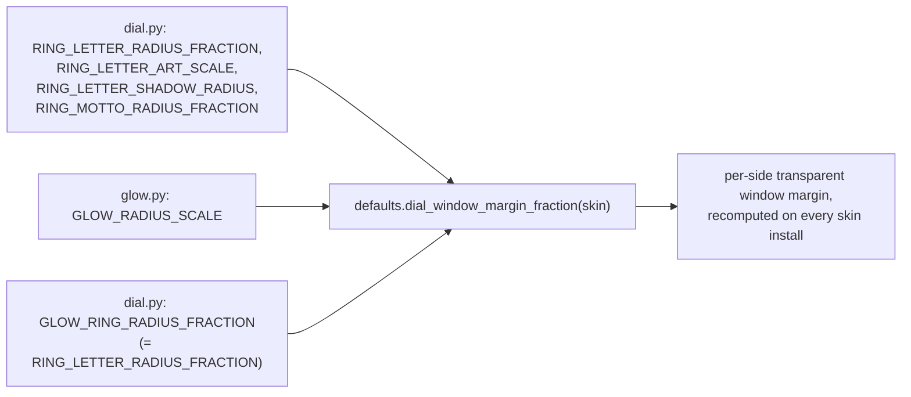

# Dial — Flow

**About:** [description](../__about/dial.md)

## Sections

```
📁 dial.py
  Window                DEFAULT_DIAL_DIAMETER, MIN/MAX, SIZE_PRESETS,
                         menu size-slider, text-visibility thresholds
  Procedural fallback    RING_TICK_*, RING_NUMERAL/LETTER/MINUTE_*,
                         NAME_LABEL_*, MARKER_BORDER_WIDTH
  Moon/Earth transit     MOON_TRANSIT_OPACITY
  Ring faces             RING_FACE_DIR, RING_TINT_*, RING_LETTER_*,
                         RING_MOTTO_*
  Hand sizing            HAND_SECOND_REACH_FRACTION, HAND_MINUTE_REACH_FRACTION
  Arm outline             ARM_OUTLINE_WIDTH
  Slot/subdial cluster   SUBDIAL_ROOT_DIR, SLOT_ROUNDEL_*,
                         SMALL_SECONDS_*, SLOT_SIZE_BY_POINTER,
                         SLOT_SEAT_OUTWARD, SUBDIAL_SHADOW_*
  Window margin           UMBRA_CONTRAST_SPANS, GLOW_RING_RADIUS_FRACTION
  Hit geometry            OMEGA_HIT_RADIUS_FRACTION
```

## Per-pointer slot sizing (a small data table worth reading as one)

```
SLOT_SIZE_BY_POINTER
  trio, hexa, aurora, calendar  -> 1.50   (big-diamond / pinned layouts)
  cross, octa, rose             -> 1.25   (slim-armed pointers)

SLOT_SEAT_OUTWARD
  cross, octa, rose  -> 1.12   (slot shifts outward to the diamond's
                                 widest point on slim arms; the
                                 between-arm 3h/21h seats stay put)
```

## The window-margin dependency chain



`dial_window_margin_fraction` is a COORDINATOR function in
`defaults.py` because it needs both `dial.py`'s ring/letter/motto
geometry AND `glow.py`'s glow extent — the fixed import DAG forbids
`dial.py` and `glow.py` from importing each other, so the value that
needs both lives one level up, in the remnant.
