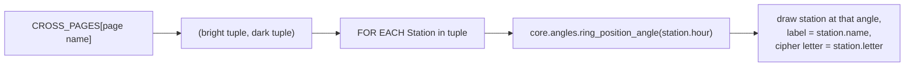

# Doctrine — Flow

**About:** [description](../__about/doctrine.md)

## The six tables

```
📁 doctrine.py
  PATH_OF_LIGHT     08h Hope -> 12h Faith -> 16h Love -> 24h Salvation
  PATH_OF_DARKNESS  20h Fear -> 24h Anger -> 04h Hate  -> 12h Suffering

  STAR (bright mnemonic)   08h Spark -> 12h Trust -> 16h Affection -> 24h Redemption
  FALL (dark mnemonic)     20h Fear  -> 24h Anger  -> 04h Loathing -> 12h Lament

  SAFE (bright cipher, assembled)   24h Salus -> 16h Agape -> 12h Fides -> 08h Elpis
  DOMY (dark cipher, assembled)     12h Dolor -> 04h Odium -> 20h Metus -> 24h Hybris

  CROSS_PAGES: page name -> (bright reading, dark reading)
    "The Two Crosses" -> (PATH_OF_LIGHT, PATH_OF_DARKNESS)
    "FALL and STAR"   -> (STAR, FALL)
    "DOMY and SAFE"   -> (SAFE, DOMY)

  UNION_FIELDS (3 persons x 4 offices, each an office/process pair)
    God        Judge/Justice · Avenger/Retribution · Creator/Reinvention · Lawgiver/Reform
    The Devil  Destroyer/Punishment · Tempter/Ruin · Prosecutor/Guilt · Catalyst/Critique
    Jesus      Redeemer/Renewal · Advocate/Salvation · Shepherd/Mercy · Preserver/Stewardship

  RING_LETTER_SEATS
    Δ (delta, 4th letter)  -> 04h
    M (mu, 12th letter)    -> 12h
    Y (upsilon, 20th)      -> 20h
    Ω (omega, 24th/last)   -> 24h
```

## How a diagram reads it



Neither cross is displaced from the Prism's own occupants: a STATION is
where a traveller stands at one hour of the journey, distinct from what
the Prism's own SEAT holds at that hour — both readings can walk the
same six arms without collision.
