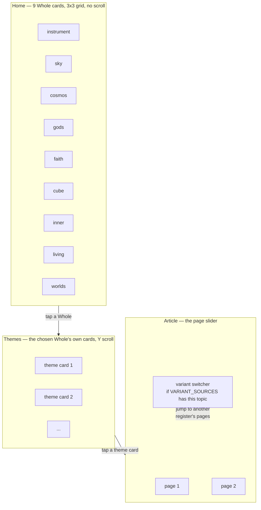
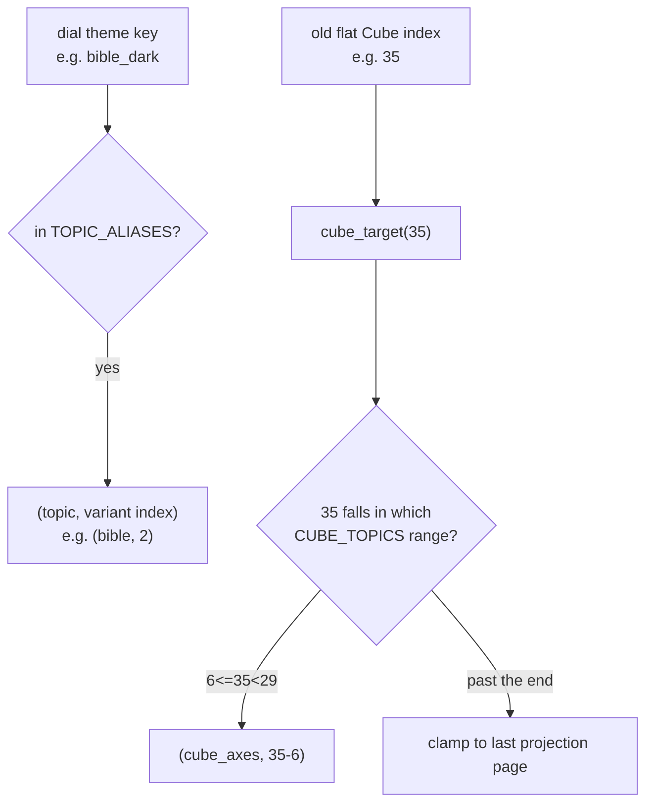

# Encyclopedia Tree — Flow

**About:** [description](../__about/encyclopedia_tree.md)

## The three-level tree



## Variant switcher arithmetic

```
ON variant switch (direction d):
    offset ← current page − start of current variant
    next   ← (current variant + d) MOD variant count
    page   ← start of next + MIN(offset, length of next − 1)
```

The offset is what carries across a switch — Monday stays Monday when
the roster changes, and a shorter variant (the Wider Court has 4 pages
against Planetary's 11) clamps to its own last page instead of
overrunning.

## Jump resolution



`cube_target` never raises — the caller is the dial, and a stale wheel
target must not take the window down.
