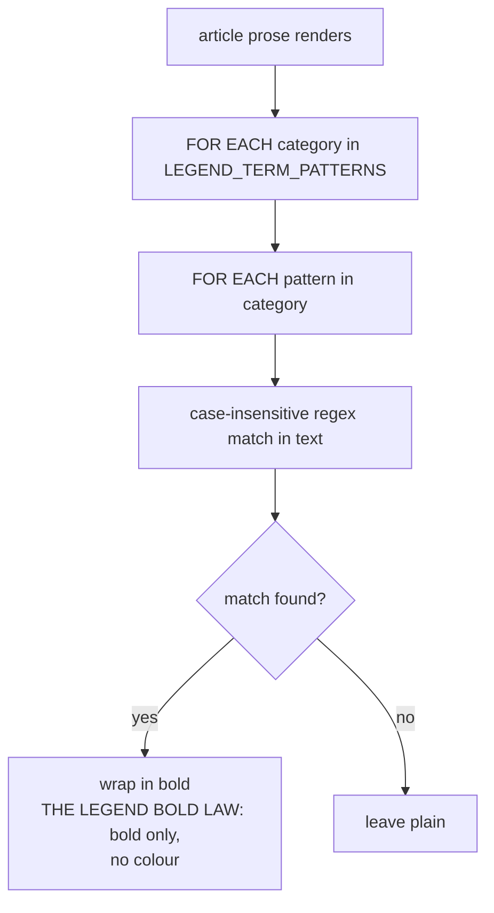

# Encyclopedia UI — Flow

**About:** [description](../__about/encyclopedia_ui.md)

## Sections

```
📁 encyclopedia_ui.py
  Article hover geometry     ARTICLE_IMAGE_WIDTH_PX ... ARTICLE_TITLE_PX
  Legend term highlighting   LEGEND_TERM_PATTERNS (virtue/vice/mood/weekday)
  Legend popup sizing        LEGEND_MAX_WIDTH_FRACTION ... LEGEND_TEASER_SENTENCES
  Encyclopedia text/card     ENCYCLOPEDIA_TEXT_WIDTH_FRACTION ...
                             ENCYCLOPEDIA_GALLERY_CARD_PADDING_PX
  Computed diagrams          CUBE_DIAGRAM_*, CANON_DIAGRAM_*
  Session 27 rework          ENCYCLOPEDIA_MIN_WIDTH_PX/_HEIGHT_PX,
                             ENCYCLOPEDIA_HOME_COLUMNS, card geometry,
                             UI_BUTTON_*, THEME_RADIUS_*, GREETINGS_*
  Hover warm sweep           HOVER_WARM_ANGLE_STEPS x HOVER_WARM_RADIAL_STEPS
  Instrument diagrams        INSTRUMENT_DIAGRAM_*, INSTRUMENT_TWILIGHT_BANDS
```

## Legend term highlighting

```
LEGEND_TERM_PATTERNS = {
  "virtue":  (English words..., Serbian case-ending regex fragments...),
  "vice":    (...),
  "mood":    (...),
  "weekday": (...),
}
```



## Hover article warm sweep

```
warm_hover_articles():
    FOR angle IN 180 steps around the dial (HOVER_WARM_ANGLE_STEPS):
        FOR ring IN 40 radial steps (HOVER_WARM_RADIAL_STEPS):
            probe the tooltip dispatch AT (angle, ring)
            IF it resolves to an article -> pre-build its hover image
        PAUSE HOVER_WARM_RING_PAUSE_S between rings   # 0.05s, stays polite
```

The 180×40 pitch keeps the probe grid under half the smallest hover
target (the Moon marker) at every supported dial diameter.

## The computed diagrams' shared ratio convention

Every `CUBE_DIAGRAM_*`/`CANON_DIAGRAM_*`/`INSTRUMENT_DIAGRAM_*` value
is a RATIO of the plate's own side (never an absolute pixel count
except the drawing's own square canvas, `*_SIDE_PX`) — one drawing
definition serves every zoom level and every window size, because the
renderer scales the whole canvas, not the individual ratios.
