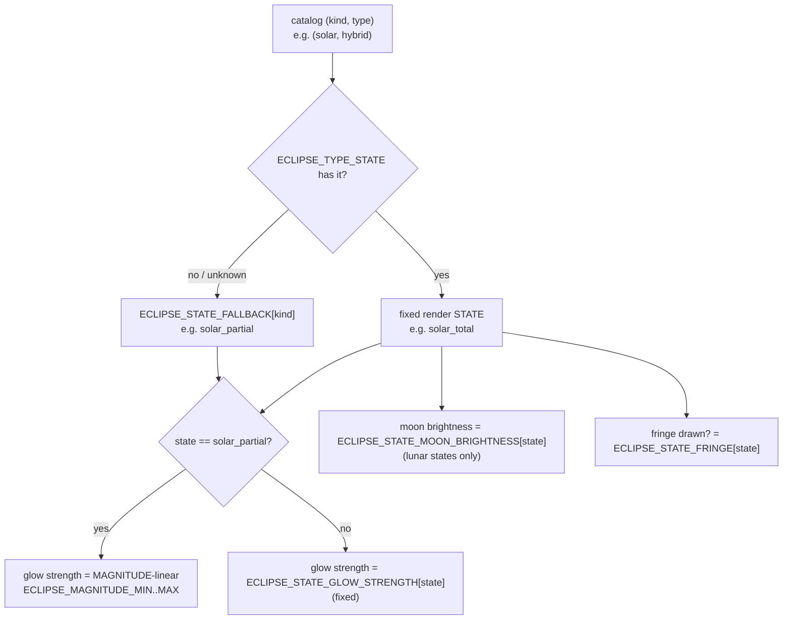

# Glow — Flow

**About:** [description](../__about/glow.md)

## Sections

```
📁 glow.py
  Season/moon event glow      GLOW_CORE_ALPHA, GLOW_MID_ALPHA, GLOW_MID_STOP,
                               GLOW_RADIUS_SCALE
  Eclipse invisibility         ECLIPSE_INVISIBLE_STRENGTH_FACTOR
  Lunar fringe geometry        ECLIPSE_LUNAR_FRINGE_STOP / _HALF_WIDTH / _ALPHA
  Magnitude -> strength ramp   ECLIPSE_MAGNITUDE_MIN/MAX, ECLIPSE_GLOW_STRENGTH_MIN/MAX
  Eclipse TYPE -> STATE table  ECLIPSE_TYPE_STATE, ECLIPSE_STATE_FALLBACK
  Per-STATE fixed triad        ECLIPSE_STATE_MOON_BRIGHTNESS
                               ECLIPSE_STATE_GLOW_STRENGTH
                               ECLIPSE_STATE_FRINGE
  Category emblem              ECLIPSE_ART_DIR, ECLIPSE_TYPE_EMBLEM
  Hover badge                  ECLIPSE_TYPE_ICON_PX
```

## The eclipse type -> render state dispatch



Pseudocode:

    resolve_eclipse_state(kind, catalog_type):
        state <- ECLIPSE_TYPE_STATE.get((kind, catalog_type))
        IF state is None:
            state <- ECLIPSE_STATE_FALLBACK[kind]
        RETURN state

    eclipse_glow_strength(state, magnitude):
        IF state == "solar_partial":
            RETURN linear_map(magnitude, MAGNITUDE_MIN..MAGNITUDE_MAX,
                               GLOW_STRENGTH_MIN..GLOW_STRENGTH_MAX)
        RETURN ECLIPSE_STATE_GLOW_STRENGTH[state]

`hybrid` solar eclipses fold into `solar_total` (the nearest sealed
state — a hybrid eclipse shows true totality along most of its ground
track) but keep their OWN category emblem in `ECLIPSE_TYPE_EMBLEM`, so
the Encyclopedia chapter still distinguishes it even though the render
state does not.
