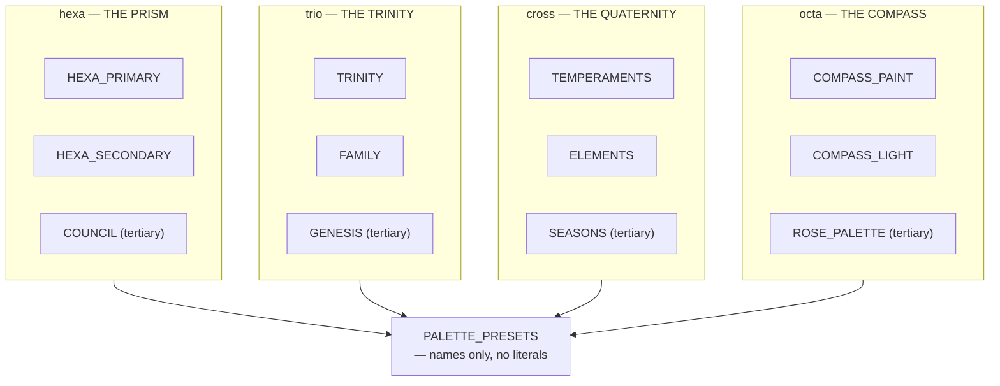

# Palette — Flow

**About:** [description](../__about/palette.md)

## The nine fixed sections

```
📁 palette.py
  §1 THE NAMED HUES              MOON_GRAY_VIOLET, MOON_SILVER
  §2 THE POINTER WHEELS          one block per pointer (see below) + PALETTE_PRESETS
  §3 THE RING                    RING_TINT_GROUPS (Lighter / Darker)
  §4 THE DIAL                    labels, markers, calendar arrow, glows, eclipses,
                                  INSTRUMENT_TWILIGHT_COLORS, INSTRUMENT_SEASON_COLORS
  §5 THE SUBDIAL AND THE SLOTS   roundel fill/border, small-seconds tick RGBA,
                                  SUBDIAL_RECOLOR_COLORS
  §6 THE DEFAULT SKIN's OWN HUES SKIN_RING_*, SKIN_PLANET_BODY_COLORS,
                                  SKIN_EARTH_*, SKIN_MOON_*
  §7 THE TRAY AND FAST-TRAVEL     TRAY_COLOR_WHEEL, FAST_TRAVEL_FLASH_*
  §8 THE UI CHROME                THEME_COLORS, UI_BUTTON_COLORS, LEGEND_*,
                                  ENCYCLOPEDIA_FINISH_*, LOOK_FILL_*
  §9 THE CHARTS                   REPORT_*, OBSERVATORY_*
```

## Section 2 — one pointer, one contiguous block



## Resolution pseudocode

    effective_palette_style(pointer, style):
        IF style IN constants.palette_styles_for(pointer):
            RETURN style
        RETURN "primary"          # a stray "tertiary" from a pointer switch

    resolve_wheel(pointer, style):
        style <- effective_palette_style(pointer, style)
        RETURN PALETTE_PRESETS[(pointer, style)]   # always a valid key after normalizing

No consumer ever indexes `PALETTE_PRESETS` with a raw, un-normalized
`(pointer, style)` pair — every reader (Design window, `watch_title`,
render layers) calls through `effective_palette_style` first.
