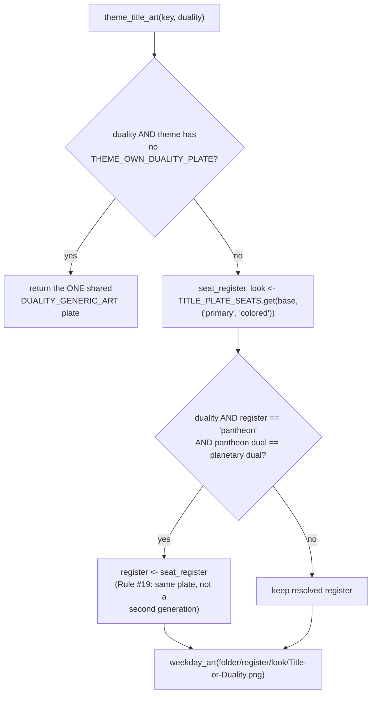

# Pantheon — Flow

**About:** [description](../__about/pantheon.md)

## The weekday tables (one row-set per theme, ~35+ themes)

```
📁 pantheon.py's WEEKDAY_* family — every table keyed by theme, then by body
  WEEKDAY_PANTHEON        theme -> {articles, files: body->candidates, names, dual, dual_names}
  WEEKDAY_THEME_NAMES     theme -> {body -> display name}         (planets, greek, norse, ... 35+ themes)
  WEEKDAY_THEME_DIRS      theme -> "art/folder/path"
  WEEKDAY_THEME_FILES     theme -> {body -> file stem}            (derived + per-theme overrides)
  WEEKDAY_DUAL_NAMES      theme -> (ruler face name, servant face name)
  WEEKDAY_DUAL_FILES      theme -> "dual/plate/stem"
  WEEKDAY_SEAT_ROSTERS    theme -> {seat label -> (stem, stem, ...)}   (cp_*, sw_dyad only)
  WEEKDAY_THEME_TITLES    theme -> "Menu / Encyclopedia title"
  WEEKDAY_MENU_TOP        ("planets",)
  WEEKDAY_MENU_GROUPS     (("Ancient Gods", (...)), ("Society", (...)), ...)
```

## pantheon_seat — the safety law

```mermaid
flowchart TB
    A["pantheon_seat(theme, body)"] --> B{theme in WEEKDAY_PANTHEON?}
    B -- no --> Z[return None]
    B -- yes --> C[FOR EACH candidate rel path\nin table.files[body], in order]
    C --> D{paths.art_file(weekday_art(rel)).exists()?}
    D -- yes --> E["return (path, name, (articles, body))\n— identity bundle, whole"]
    D -- no, try next --> C
    C -- none matched --> Z
```

The bundle is always whole: file, display name and article key travel
together, so a half-generated pantheon can never show the right art
next to the wrong name (or vice versa) — a miss falls all the way back
to the caller's own planetary bundle, never a partial pantheon match.

## THE UNIVERSAL ROTATION CONVENTION

```mermaid
flowchart TB
    A["rotating_art_file(canonical_path, on_date)"] --> B{canonical_path resolves\non disk at all?}
    B -- no --> Z[return None]
    B -- yes --> C{canonical_path is the\nCANONICAL member of a\nWEEKDAY_SEAT_ROSTERS entry?}
    C -- yes --> D{NINTH_MECHANISMS[theme]\n== 'term_weekly'?}
    D -- yes --> E["_pick_weekly_mandate(roster candidates, on_date)\n— ISO week parity"]
    D -- no --> F["_pick_rotation(roster candidates, on_date)\n— date modulo"]
    C -- no --> G["_rotation_candidates(canonical_path.parent,\ncanonical_path.stem)\n— <Name>.png + <Name>_v*.png siblings"]
    G --> H["_pick_rotation(candidates, on_date)"]
```

Pseudocode of the shared picker:

    pick_rotation(candidates, on_date):
        IF candidates is empty: RETURN None          # caller keeps its own fallback
        IF len(candidates) == 1: RETURN candidates[0] # nothing to rotate
        index <- (on_date.toordinal() // ROTATION_DAYS) MOD len(candidates)
        RETURN candidates[index]

    pick_weekly_mandate(candidates, on_date):         # cp_corpo's own cadence
        IF candidates is empty: RETURN None
        IF len(candidates) == 1: RETURN candidates[0]
        index <- on_date.isocalendar().week MOD len(candidates)
        RETURN candidates[index]

The SAME date always yields the SAME file; consecutive dates advance
through the pool. A "seat roster" (declared in `WEEKDAY_SEAT_ROSTERS`)
rotates through DIFFERENT NAMED FIGURES on one seat; every other
canonical path rotates through `_v2`-style ARTWORK VARIANTS of the
SAME figure — two different pool shapes, one shared picker.

## Title plate resolution


