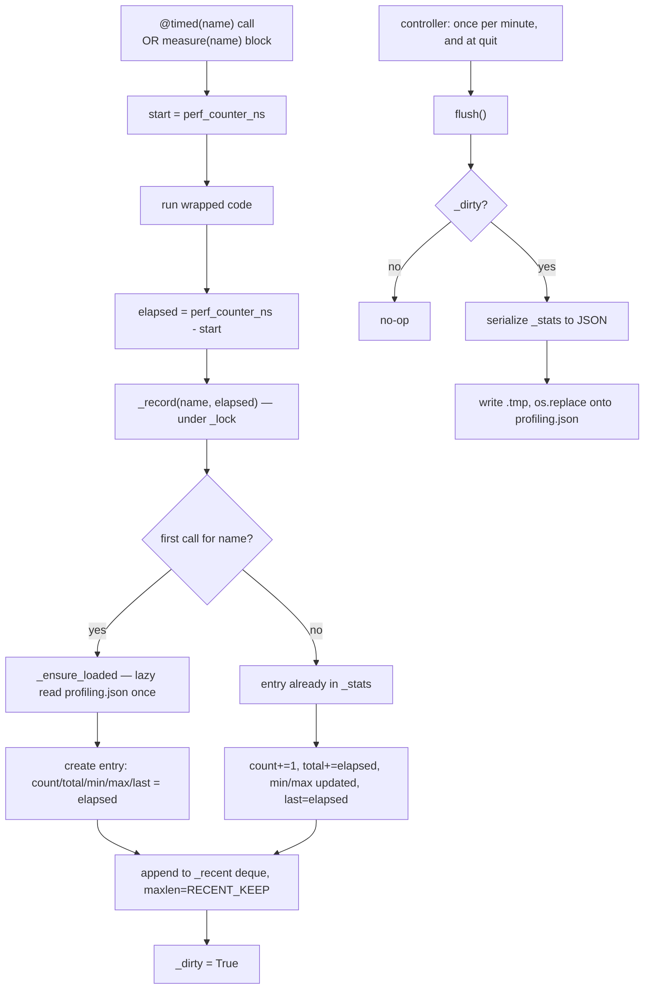

# Profiling — Flow

**About:** [description](../__about/profiling.md)

## Algorithm

Pseudocode:

    record(name, elapsed_ns):
        WITH lock:
            ensure_loaded()   # lazy first read of profiling.json
            entry <- stats.get(name) OR fresh {count:0, total:0, min:elapsed, max:elapsed}
            entry.count += 1; entry.total += elapsed_ns
            entry.min = MIN(entry.min, elapsed_ns); entry.max = MAX(entry.max, elapsed_ns)
            entry.last = elapsed_ns
            recent[name].append(elapsed_ns)   # session-only, capped deque
            dirty <- True

    flush():                          # called by the controller, never by record()
        WITH lock:
            IF NOT dirty: RETURN
            payload <- serialize(stats)
            dirty <- False
        atomically write payload to profiling.json (tmp + os.replace)

Recording never touches disk — it only sets `_dirty`. The controller
is the sole caller of `flush()`, so measuring a hot render path never
risks a stall from file I/O on that path itself.
