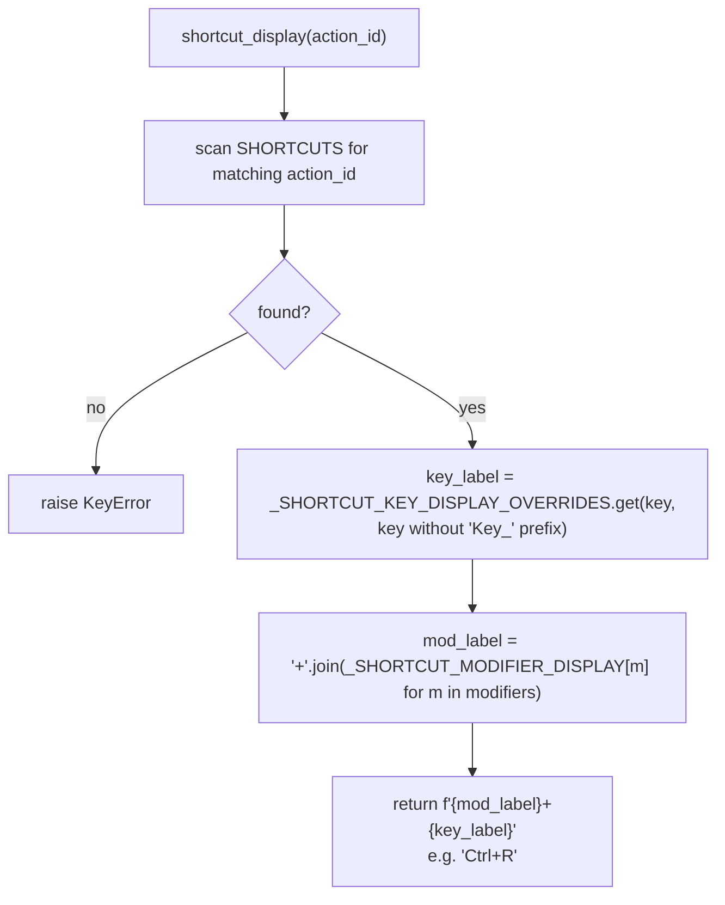
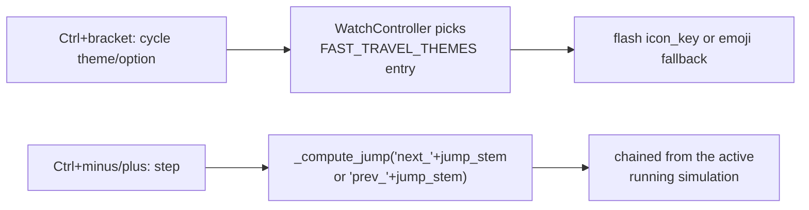

# Shortcuts — Flow

**About:** [description](../__about/shortcuts.md)

## Table shapes

```
📁 shortcuts.py
  SHORTCUTS: tuple of (action_id, key_name, modifier_names, description)
    e.g. ("cycle_ring", "Key_R", ("ControlModifier",), "Cycle to the next Ring preset")
    21 rows — menu actions, slot cycling (1/2/3 x complication/theme),
    Fast Travel (theme/option/past/future), Locations (poles/Greenwich/cities)

  FAST_TRAVEL_THEMES: tuple of dicts (owner selector spec 2026-08-11 — SIX categories)
    {id, title, icon_key, emoji, options: tuple of {id, title, jump_stem}}
    "solar_eclipse" -> any / total / annular / partial / hybrid
    "lunar_eclipse" -> any / total / partial / penumbral
    "sun"           -> any / solstice / equinox
    "moon"          -> any / full / new / quarter
    "calendar"      -> day / month / year / century / millennium
    "clock"         -> hour / minute / second
```

## shortcut_display resolution



## Fast Travel dispatch



Eclipse `jump_stem`s carry an optional catalog TYPE suffix
(`solar_eclipse_total`, `lunar_eclipse_penumbral`, …), matched by
`WatchController._ECLIPSE_JUMP_PATTERN` and passed through to
`data.deep_time.eclipse_after`/`eclipse_before`'s `type_` filter
(owner selector spec 2026-08-11). The Time category's `jump_stem`s
(`hour`/`minute`/`second`) resolve through the separate `_TIME_JUMPS`
table — plain timedeltas on the flowing simulated moment, never
minute-floored.
