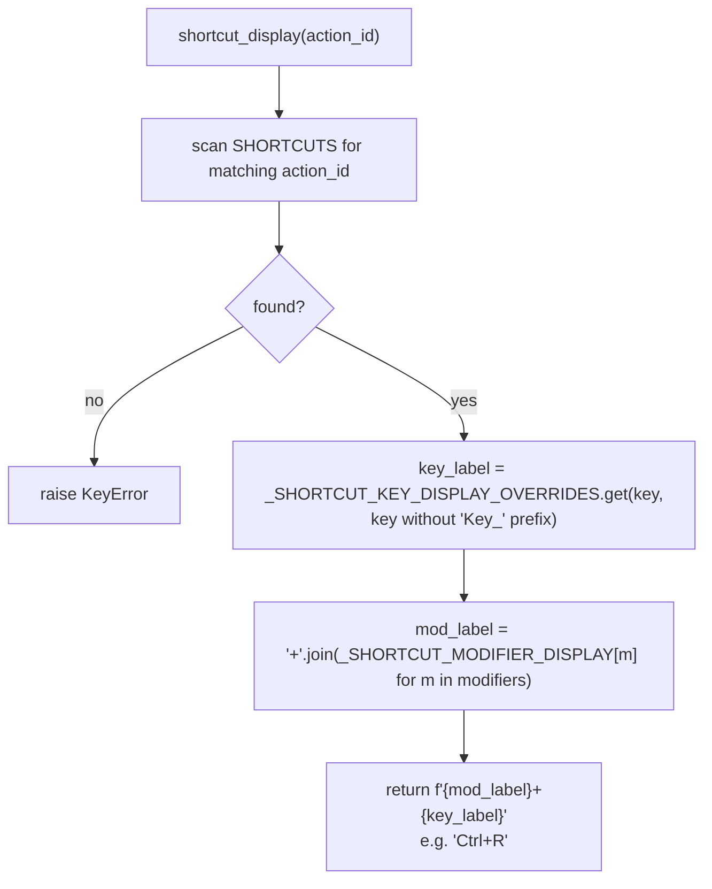
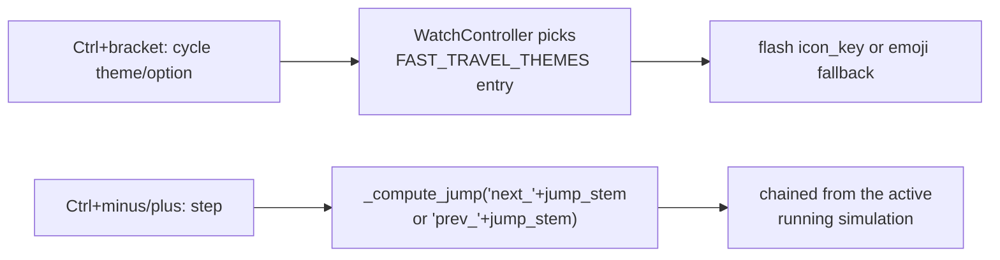

# Shortcuts — Flow

**About:** [description](../__about/shortcuts.md)

## Table shapes

```
📁 shortcuts.py
  SHORTCUTS: tuple of (action_id, key_name, modifier_names, description)
    e.g. ("cycle_ring", "Key_R", ("ControlModifier",), "Cycle to the next Ring preset")
    21 rows — menu actions, slot cycling (1/2/3 x complication/theme),
    Fast Travel (theme/option/past/future), Locations (poles/Greenwich/cities)

  FAST_TRAVEL_THEMES: tuple of dicts
    {id, title, icon_key, emoji, options: tuple of {id, title, jump_stem}}
    "sun"      -> any / solstice / equinox
    "moon"     -> full / new / quarter / eclipse
    "calendar" -> day / month / year / century / millennium
```

## shortcut_display resolution



## Fast Travel dispatch


