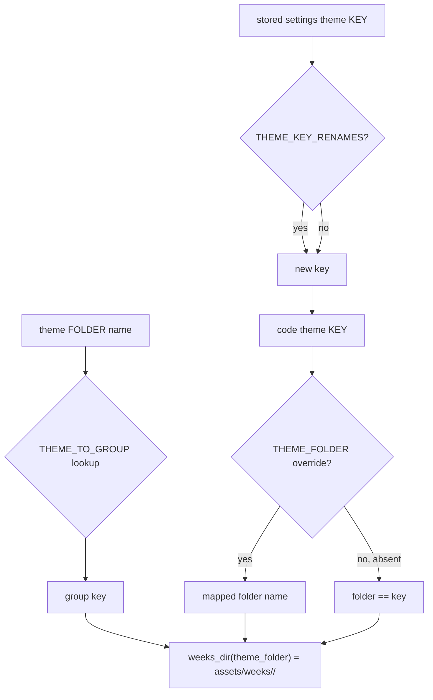

# Taxonomy — Flow

**About:** [description](../__about/taxonomy.md)

## The hierarchy

```
📁 CATEGORIES (5 roots)
  calendars    "Calendars"      — the Dozens (12 + 13th)
  weeks        "Weeks"          — every weekday theme
  archetypes   "Archetypes"     — the pointer archetypes
  celestial    "Celestial"      — sun/moon/seasons/eclipses/eras/earth
  instrument   "Instrument"     — dial furniture (outside the encyclopedia mirror)

📁 WEEK_GROUPS (8 groups, only "weeks" branches this deep)
  celestial_bodies  -> planets, cosmos, continents
  myth              -> greek, norse, egypt, slavic, age_of_heroes, celestial_court
  faith             -> bible, creeds
  crafts            -> alchemy, japan, profession, corporate
  societies         -> wolf, bee, elephant
  inner_wheel       -> virtue, sin, mood, intelligence
  gaming            -> wow_alliance, wow_horde, wow_evil, cp_gangs, cp_street, cp_corpo
  films             -> sw_jedi, sw_sith, sw_dyad
```

## Resolution paths



Pseudocode:

    theme_folder(theme):
        RETURN THEME_FOLDER.get(theme, theme)

    weeks_dir(theme_folder_name):
        group <- THEME_TO_GROUP[theme_folder_name]   # raises if unknown
        RETURN weeks_root() / group / theme_folder_name

Every consumer that needs a theme's art directory goes through
`weeks_dir(theme_folder(code_key))` — never assembles the group/theme
path by hand.
