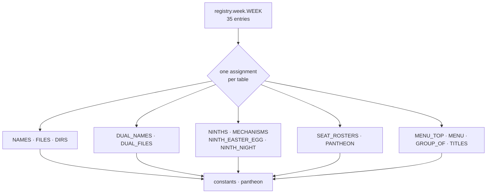

# Registry derivation — Flow

**About:** [description](../__about/__init__.md)

## From one entry to every legacy table

## The one lazy reach

`COMPUTED` marks a value the registry refuses to freeze. Only the
Continents carry it: their stems ARE the dial's Earth faces, so
`_earth_stems()` builds them from `continents.CONTINENTS_REGIONS` at
derivation time. The import sits inside the function, so the registry
stays importable from anywhere in `config`.

## Splitting one field into the two alt tables

`ninth.alt` is one field. The mechanism decides which table it lands
in: `easter_egg` → `NINTH_EASTER_EGG` (a sky trigger), `daynight` →
`NINTH_NIGHT` (the daylight state). `term_weekly` needs no alt table —
its roster already names both halves.
