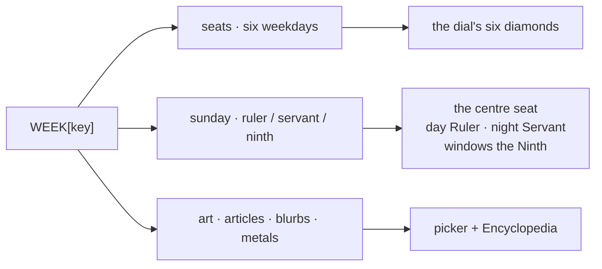

# Week Registry — Flow

**About:** [description](../__about/week.md)

## One theme entry, and who reads which field

## The seat's two names

    'monday': {"body": 'moon', "name": 'Selene (Σελήνη)', "stem": 'Selene'}

The seat key is the ENGLISH DAY, `body` is the same seat's planetary
name. Both conventions are canon; the registry holds them side by side
so neither has to be translated in anyone's head.

## Rotation

A seat that can turn declares its whole roster, canonical member first:

    'tuesday': {"body": 'mars', "name": 'Finn · Phasma',
                "stem": 'Finn', "rotates": ('Finn', 'Phasma')}

Declared order IS rotation order. The label names every member because
the plate turns and the label does not.
