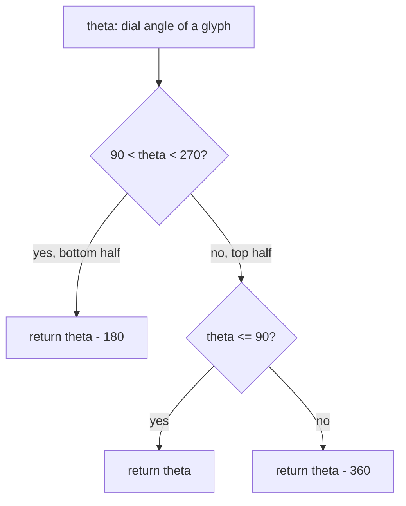

# Angles — Flow

**About:** [description](../__about/angles.md)

## Algorithm

Every function here is an independent pure mapping; the one with real
branching logic is `readable_rotation_deg` (keeping ring-band glyphs
upright), shown below alongside the two directional formulas it shares
its "top vs bottom half" convention with.

Pseudocode (language-neutral):

    FUNCTION time_to_dial_angle(t):
        secs = t.hour * 3600 + t.minute * 60 + t.second
        RETURN (secs / 86400 * 360 + DIAL_OFFSET_DEG) MOD 360

    FUNCTION ring_position_angle(position):
        RETURN (position * 15 + DIAL_OFFSET_DEG) MOD 360

    FUNCTION readable_rotation_deg(theta):
        IF 90 < theta < 270:              # lower half of the dial
            RETURN theta - 180             # flip so text stays upright
        ELSE IF theta <= 90:
            RETURN theta
        ELSE:
            RETURN theta - 360

    FUNCTION star_rotation_deg(solar_noon):
        secs = solar_noon.hour*3600 + solar_noon.minute*60 + solar_noon.second
        RETURN (secs - SOLAR_NOON_SECS) / SECONDS_PER_DEGREE

    FUNCTION hours_between(angle_a, angle_b):
        RETURN (((angle_a - angle_b + 180) MOD 360) - 180) / 15
