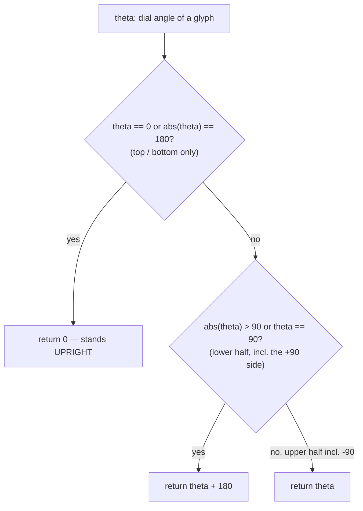

# Angles — Flow

**About:** [description](../__about/angles.md)

## Algorithm

Every function here is an independent pure mapping; the one with real
branching logic is `readable_rotation_deg` (keeping ring-band glyphs
upright), shown below alongside the two directional formulas it shares
its "top vs bottom half" convention with.

**ONE SEATING LAW** (owner defect 2026-08-07): `readable_rotation_deg` no
longer owns a law of its own. It delegates to `core.numerals.seat_rotation`
— the law the NUMERALS already obeyed — and folds the answer into
(-180, 180], this door's own long-standing output range. The two used to
be forks that disagreed on exactly the four SQUARE angles, so The One's 18
(right) and 6 (left) jewels lay sideways beside upright numerals.

Amended by the owner 2026-08-11, THE FLOWING SIDES: only TOP (0) and
BOTTOM (180) stand upright of their own right; the SIDE squares (90/270)
FLOW with the half they open clockwise instead of standing upright
themselves.

Pseudocode (language-neutral):

    FUNCTION time_to_dial_angle(t):
        secs = t.hour * 3600 + t.minute * 60 + t.second
        RETURN (secs / 86400 * 360 + DIAL_OFFSET_DEG) MOD 360

    FUNCTION ring_position_angle(position):
        RETURN (position * 15 + DIAL_OFFSET_DEG) MOD 360

    FUNCTION readable_rotation_deg(theta):        # THE ONE SEATING LAW
        RETURN fold(seat_rotation(theta, "arc"))  # core.numerals

    # which is, written out (owner amendment 2026-08-11, THE FLOWING SIDES):
    #   IF theta == 0 or ABS(theta) == 180:     RETURN 0   # top / bottom only
    #   IF ABS(theta) > 90 OR theta == 90:      RETURN theta + 180  # lower half, incl. +90 side
    #   ELSE:                                   RETURN theta        # upper half, incl. -90 side

    FUNCTION star_rotation_deg(solar_noon):
        secs = solar_noon.hour*3600 + solar_noon.minute*60 + solar_noon.second
        RETURN (secs - SOLAR_NOON_SECS) / SECONDS_PER_DEGREE

    FUNCTION hours_between(angle_a, angle_b):
        RETURN (((angle_a - angle_b + 180) MOD 360) - 180) / 15
