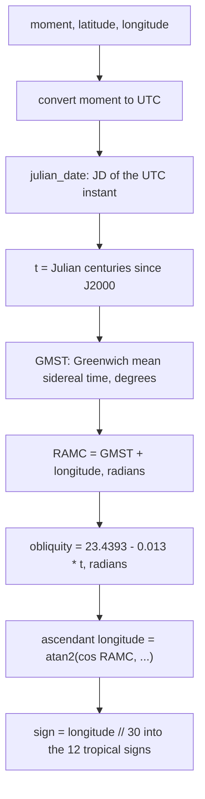

# Ascendant — Flow

**About:** [description](../__about/ascendant.md)

## Algorithm

Pseudocode (language-neutral):

    FUNCTION ascendant_sign(moment, latitude, longitude):
        moment_utc = moment converted to UTC
        jd = julian_date(moment_utc)
        t = (jd - 2451545.0) / 36525.0                 # Julian centuries since J2000

        gmst = (280.46061837
                + 360.98564736629 * (jd - 2451545.0)
                + 0.000387933 * t^2
                - t^3 / 38710000) MOD 360

        ramc = radians((gmst + longitude) MOD 360)
        obliquity = radians(23.4392911 - 0.0130042 * t)
        phi = radians(latitude)

        longitude_asc = degrees(atan2(
            cos(ramc),
            -(sin(ramc) * cos(obliquity) + tan(phi) * sin(obliquity))
        )) MOD 360

        RETURN SIGNS[ int(longitude_asc / 30) MOD 12 ]
